+++
title = 'HackTheBox Forest Write-Up: Active Directory 101'
date = 2023-07-26T23:45:25+03:00
draft = false
+++

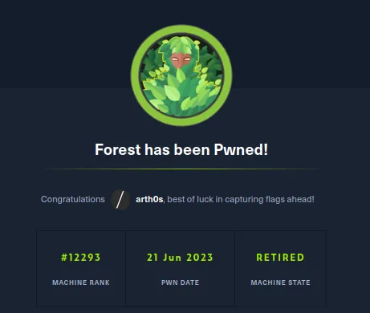

Forest is an easy [HackTheBox](https://hackthebox.com/) machine which I did as part of the [Active Directory 101](https://app.hackthebox.com/tracks/Active-Directory-101) track.

It requires that you're familiar with SMB enumeration, hash cracking, AS-REP roasting, basic AD enumeration and some Impacket scripts.

## Enumeration

I started with a basic nmap scan first just to see which ports are open and then moved on to enumerating those specifically with the following command:

`nmap -Pn -sCV -p53,88,135,139,389,445,464,593,636,3268,3269 10.10.10.161`

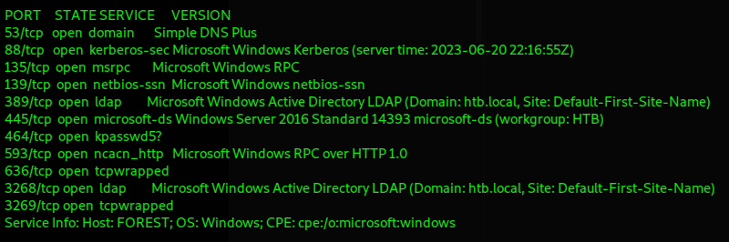

The open ports are more or less what you would except to see on a Domain Controller.

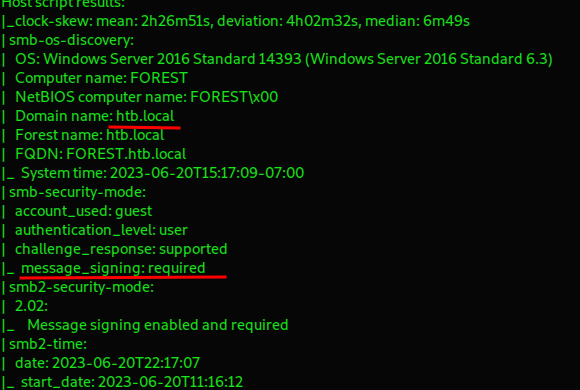

We have the domain and forest name, and we also find out that message signing is not just enabled but required which cuts off some attack paths for us right off the bat.

### Port 445 — SMB

Let's do some SMB enumeration anyway, starting with **smbclient**:

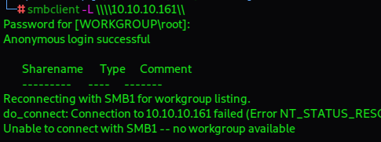

Anonymous login is successful, but no shares are listed.

Next we'll run enum4linux, and this actually gives us back some information.

`enum4linux -a 10.10.10.161`

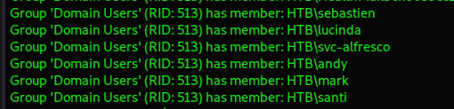

The account "svc-alfresco" is immediately eye-catching. It's a service account which tend to be configured with too permissive privileges.

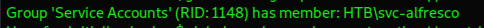

Enum4Linux also gives us the password policy which is great news, as we'll likely be able to crack some hashes with such a weak policy.

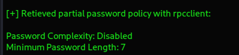

### AS-REP Roasting

Since we only have some usernames, we could try to perform an AS-REP roasting attack.

AS-REP Roasting is a technique that can let us retrieve password hashes for AD users whose account options have been set to "Do not require Kerberos pre-authentication".

We need the `GetNPUsers.py` script from Impacket to perferm the attack. We're going to use the -format flag to ensure any hashes will be ready for hashcat.

We'll run the script with the DC IP and domain name, if that doesn't work, we'll put the users we've gathered in a list and try to check against that.

`GetNPUsers.py -dc-ip 10.10.10.161 -request 'htb-local/' -format hashcat`

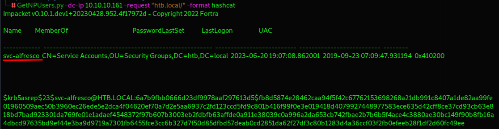

And we've got a hash for the service account we found earlier. Perfect.

Time to put hashcat to work and see if we can crack it.

What we have is a Kerberos 5, etype 23, AS-REP hash, which corresponds to hash mode 18200 in hashcat.

`hashcat -a 0 -m 18200 nphash.txt /usr/share/wordlists/rockyou.txt`

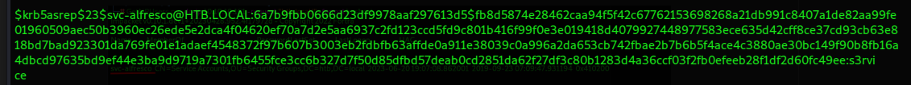

We have a hit, the hash is quickly cracked and the password is s3rvice, which goes along with the weak 7-character minimum password policy.

So now we have some credentials - svc-alfresco : s3rvice.

## User Flag

Now let's use those credentials to try and gain a shell on the system. We don't have a lot of options, psexec and the like will not work.

My next thought was to try with Evil-WinRM and it worked!

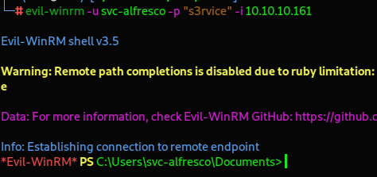

We can grab the user flag from the Desktop of our user.

## Active Directory Enumeration

Now let's upload SharpHound using the in-built upload function of Evil-WinRM and run it so we can enumerate the domain.

`upload /root/Downloads/HTB/Forest/SharpHound.exe C:\Users\svc-alfresco\Desktop\SharpHound.exe`

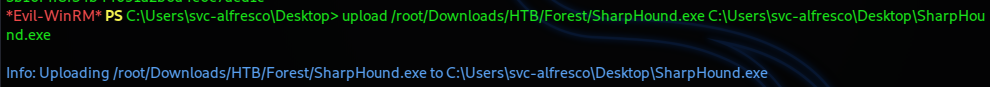

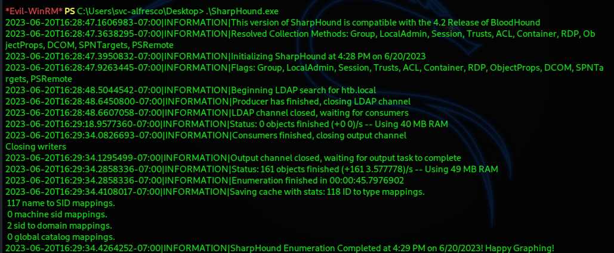

We can then use the download function to transfer the resulting ***.zip*** file back to our own machine so we can import it into BloodHound.

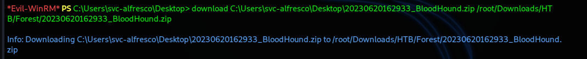

Once the import is done, we can mark the user svc-alfresco as owned. Let's check for the shortest path to Domain Admin from our owned principals.

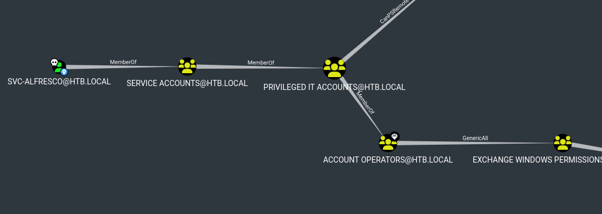

There's clearly a lot of group nesting going on in this domain, which is quite useful to us.

`svc-alfresco` is a service account, part of the group called "*Service Accounts*". That group itself is part of the group "*Privileged IT Accounts*", which belongs to the "*Account Operators*" group.

We have the privileges of all of these groups.

The "*Account Operators*" group has **GenericAll** permissions over the "*Exchange Windows Permissions*" group, which means we do, so we can do anything we want, we can control the group membership of "*Exchange Windows Permissions*", therefore we can add a user directly to that group.

Now that group has **WriteDacl** permissions over the HTB.LOCAL, that means we have permissions to modify the DACL (Discretionary Access Control List) on the domain.

With write access to the target object's DACL, we can grant ourselves any privilege we want on the object, such as DCSync rights.

We're largely just going to follow the instructions that we get from the BloodHound help menu.

We're going to need PowerView to succesfully exploit this, so we'll upload it to the machine.

### Exploitation

We upload and import the module into Powershell.

We need to authenticate to the Domain Controller as a member of the "*Exchange Windows Permissions*" group. In order do this along with the PowerView function `Add-DomainObjectAcl`, we will first create a PSCredential object:

```PowerShell
$username = 'svc-alfresco';
$password = 's3rvice';
$securePassword = ConvertTo-SecureString $password -AsPlainText -Force; 
$credential = New-Object System.Management.Automation.PSCredential $username, $securePassword;
```
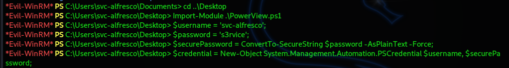

Then we're going to add our user svc-alfresco to the "*Exchange Windows Permissions*" group.

```PowerShell
Add-ADGroupMember -Identity "EXCHANGE WINDOWS PERMISSIONS" -Members 'svc-alfresco'
```
And after that we're going to run the command that will grant us DCSync rights.

```PowerShell
Add-DomainObjectAcl -TargetIdentity 'DC=htb,DC=local' -Rights DCSync -Verbose -PrincipalIdentity 'htb\svc-alfresco' -credential $credential
```
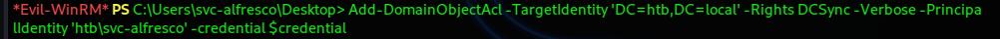

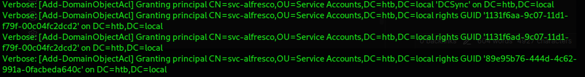

## Root Flag

I then tried to upload and run **mimikatz** on the machine, but it threw an error and didn't work.

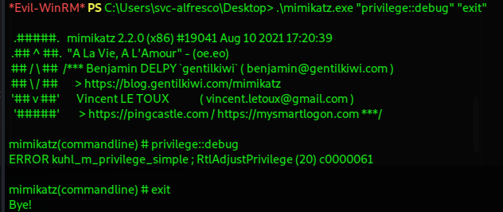

That's not our only option though. Impacket to the rescue once again.

I tried to run `secretsdump.py` with our user and their newly granted privileges made the attempt successful.

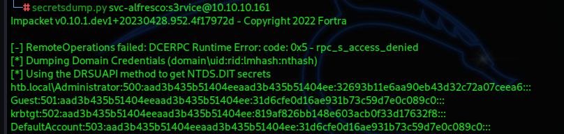

Now that we have the Administrator hash, the domain is as good as ours.

We just need to perform a **pass-the-hash** attack, which we can do once again with Evil-WinRM.

We need the `-H` flag and we can pass the LM part of the NTLM hash that we dumped from the Domain Controller.

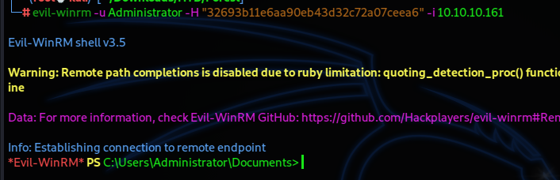

We've successfully logged in as the Administrator and we can grab the root flag from the Administrator's desktop.

---

Thank you to the creators of this box — [egre55](https://app.hackthebox.com/users/1190) and [mrb3n](https://app.hackthebox.com/users/2984). It's a very fun Active Directory box to test your enumeration skills, knowledge of common AD attacks and tools.

If you made it this far, thank you for reading!