+++
title = 'HackTheBox Inject Write-Up'
date = 2023-07-08T09:45:12+03:00
draft = false
+++

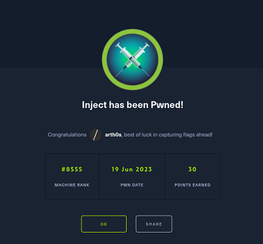

[Inject](https://app.hackthebox.com/machines/Inject) is an easy [HackTheBox](https://hackthebox.com/) machine which was just retired. It tests your ability to exploit a web application vulnerable to File Inclusion, use that to explore the file system via directory traversal, gain enough information to receive remote code execution and then escalate your privileges using what you find on the system.

## Enumeration

We'll begin with a simple nmap scan and then enumerate the ports it finds more thoroughly.

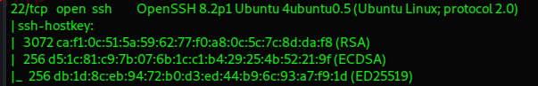

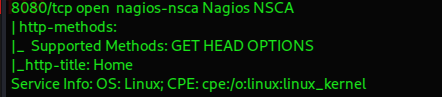

We have SSH and HTTP open on ports 22 and 8080.

We navigate to the web page, click on every available link, but only two options redirect us to a different page, which is the Blogs option and the Upload option.

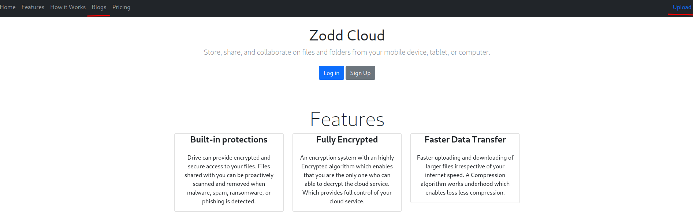

Nothing catches our interest in the Blogs section, but an upload form is always noteworthy.

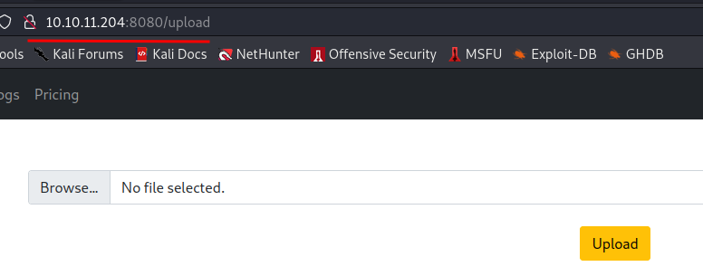

We can successfully upload a ***jpeg*** file and we're provided with a link to view it.

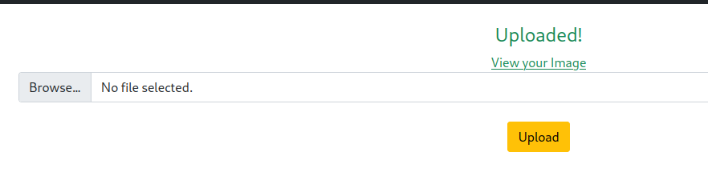

### Local File Inclusion

When we navigate to the link, we see that it uses the img parameter, which is interesting as it means that it may be vulnerable to Local File Inclusion.

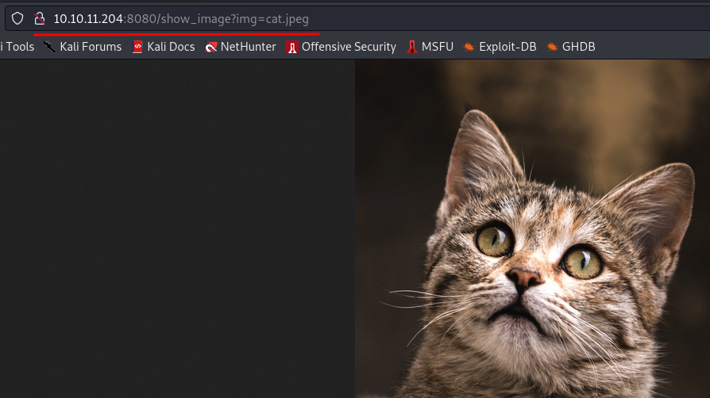
*Was it necessary to leave the cat in the screenshot? No. Is the cat majestic? Yes. You're welcome.*

We're going to open up BurpSuite, refresh the page and capture the request.

Then we can alter it and try to read the `/etc/passwd` file which is met with success.

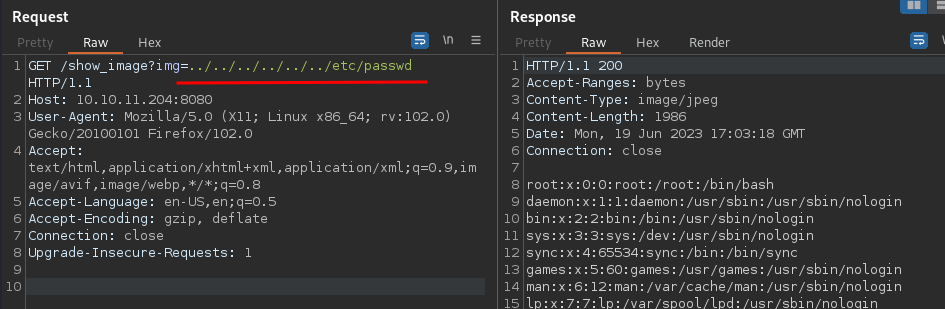

At the bottom of the output we can see the users ***phil*** and ***frank***:

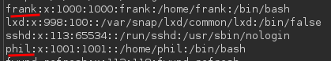

We can try and investigate the file system more.

We find that the `user.txt` file is in phil's home directory.

We can explore each directory in the file system. I recommend you try it out for yourself, see if you come across anything interesting, take notes along the way.

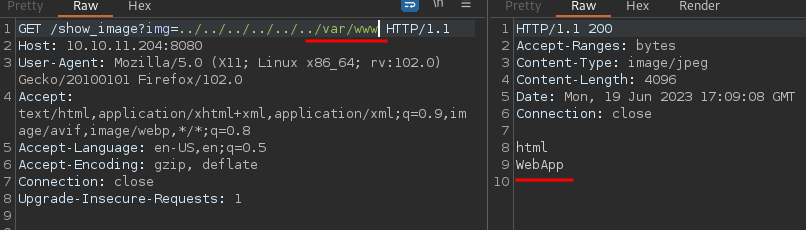

Eventually we come across this folder. Let's find out what that's about.

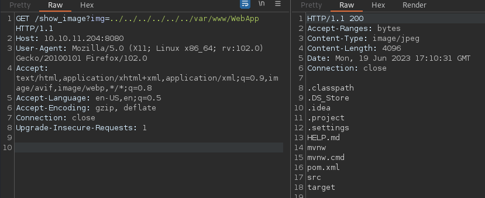

We end up reading the `pom.xml` file, which has something interesting for us:

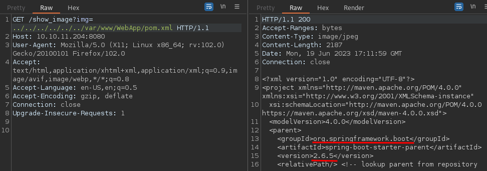

### Vulnerable Framework

It tells us that what we're dealing with here is the Spring Framework for Java, version 2.6.5.

If we google this along with "exploit", we find that this version is vulnerable to **CVE-2022–22965** aka Spring4Shell and **CVE-2022–22963** which allows for remote code execution and that is wonderful news for us.

There's plenty of python scripts on GitHub for Spring4Shell, but they don't seem to work against our application.

We find [this script](https://github.com/J0ey17/CVE-2022-22963_Reverse-Shell-Exploit), however, for CVE-2022–22963.

It works like a charm on the first try:

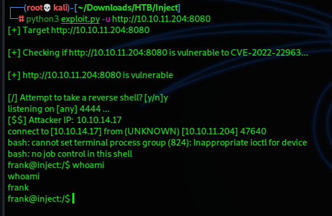

And just like that we have a shell as **frank** who we found earlier.

We can stabilise our shell a bit.

```bash
python3 -c 'import pty;pty.spawn("/bin/bash")'
export TERM=xterm
```

We don't have frank's password, so we can't execute `sudo -l`.

We also don't find anything interesting with the SUID bit set when we run a find command.

```bash
find / -perm -u=s -type f 2>/dev/null
```

I thought back to when we were exploring the file system and I do recall seeing an uncommon directory in frank's home folder.

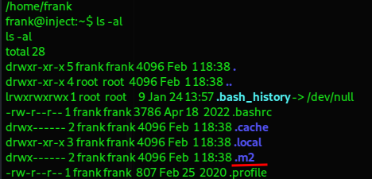

There we find a `settings.xml` file that we can read:

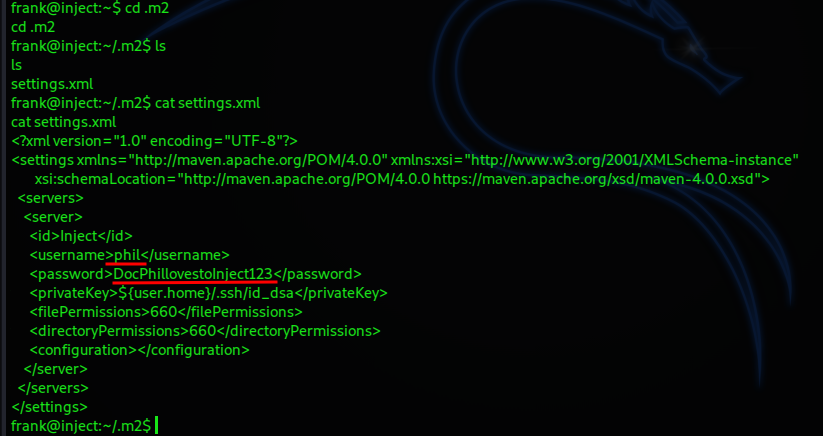

## User Flag

Inside it we have credentials for phil, so we can use those to switch to that user.

`phil : DocPhillovestoInject123`

And we can get the user flag from phil's home directory.

We're going to upload and run **linpeas** on the machine. Scrolling down the output things don't look very promising until we come across this. A `.yml` automation file.

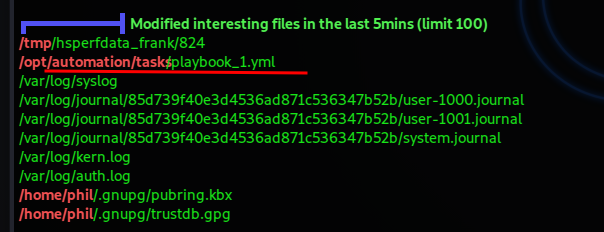

Let's figure out what this does.

What we have is an Ansible playbook written in YAML format. If you haven't heard of Ansible, it is an open-source automation tool that allows you to define and manage infrastructure as code.

```yaml
- hosts: localhost
  tasks:
  - name: Checking webapp service
    ansible.builtin.systemd:
      name: webapp
      enabled: yes
      state: started
```
Let's breakdown the file so we can understand what's going on.

We have a playbook that will be executed on the local machine aka localhost. The name of the task that will be executed is "**Checking webapp service**", which hints at what the playbook does.

We've got the ***[ansible.builtin.systemd module](https://docs.ansible.com/ansible/latest/collections/ansible/builtin/systemd_module.html)***, which is included in Ansible by default and controls system units.

The module in this case is managing the webapp service. The webapp service should be both enabled and started. In case it isn't for some reason, Ansible will start it.

The files in the `/opt/automation/tasks` directory must be run by Ansible on a given time frame. We don't have permissions to change the file,, but we can write to the given directory, so what if we wrote our own `.yml` file and put it in the same directory? Ansible should execute our playbook file as well.

## Root Flag

I took as a base the format of the playbook we found, did some research and came up with a bare-bones `.yml` file that should (hopefully) let us copy the `root.txt` file and read it once it's run by Ansible with root privileges.

```yaml
- hosts: localhost
  tasks:
    - name: Cat and copy root
      ansible.builtin.shell: cat /root/root.txt > /home/phil/root.txt
```

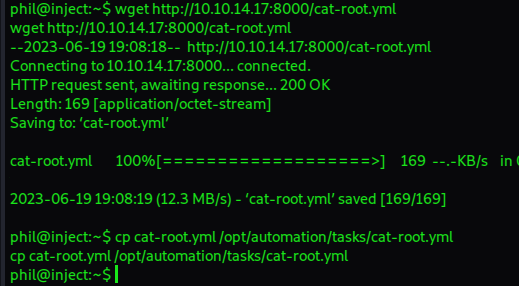

I created the file on my attacker machine, uploaded it to the target box and copied it to the `/opt/automation/tasks` directory.

We just have to give it a bit of time and there we go:

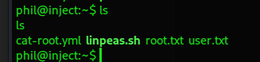

Now we can grab the root flag.

---

Thank you to the creator of this box — [rajHere](https://app.hackthebox.com/users/396413). It's very good to show how powerful LFI can be, along with the dangers of running an outdated framework.


