+++
title = 'HackTheBox MonitorsTwo Write-Up'
date = 2023-09-02T14:32:25+03:00
draft = false
+++

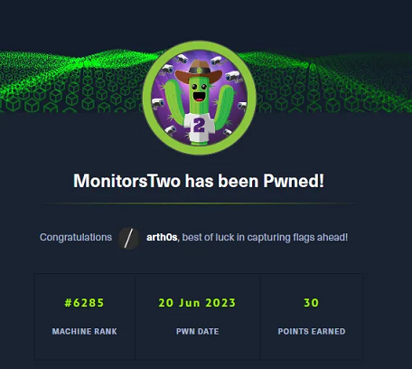

[MonitorsTwo](https://app.hackthebox.com/machines/MonitorsTwo) is an easy HackTheBox machine that tests your ability to enumerate, find and run applicable exploits and escape a container.

## Enumeration

As usual, we'll begin with an nmap scan. I like to first find out which ports are open and then run a more aggressive scan to find out additional information about them.

`nmap -sCV -p22,80 10.10.11.211`

We have SSH and HTTP open on ports 22 and 80.

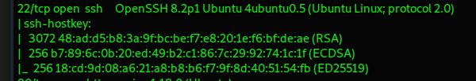

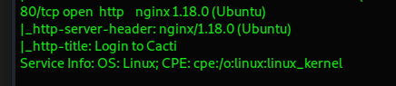

There's very little we can do with SSH without credentials or a horribly outdated version, so we can just strike it off and start with port 80.

When we have a website, the first thing we do, of course, is visit it.

### Vulnerable Web App

We go to the website and we are greeted with a login page.

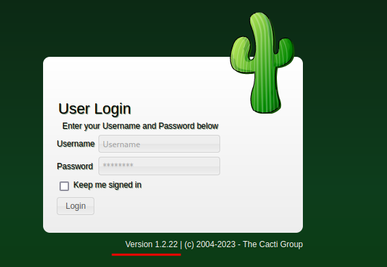

The login page already reveals too much information. We find out that there's Cacti running, which is an open-source management framework, and the version running is 1.2.22.

We google "*cacti version 1.2.22*" and we're immediately greeted with known vulnerabilities and exploits:

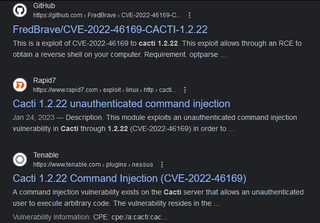

We have CVE-2022–46169 which allows unauthenticated command injection. Perfect.

We’ll visit the [GitHub page](https://github.com/FredBrave/CVE-2022-46169-CACTI-1.2.22) that comes up in our search, which should allow us to obtain a reverse shell.

We need to start a listener on our machine and then run the exploit as shown.

And it works first try out of the box!

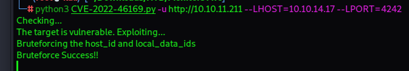

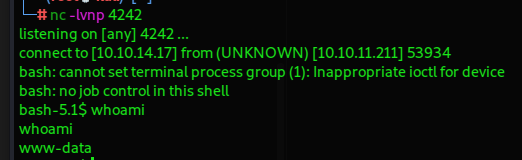

### Something strange is going on

We have a shell as www-data. I try to stabilise the shell a bit, but it seems there is no python installed, which is strange.

We can’t run `sudo -l` either under the circumstances.

But we can find files with SUID set, which gives us two immediate escalation paths to root

`find / -perm -u=s -type f 2>/dev/null`

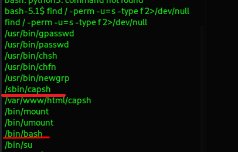

We can run `/sbin/capsh --gid=0 --uid=0 --` or `/bin/bash -p`, both of which would get us root access.

Something is wrong, however, there are no flags to be found, no nothing. The strangeness continues.

Let's upload **linpeas** to the machine and see what information we can get from that.

Running **linpeas** immediately lets us know that we are actually in a Docker container.

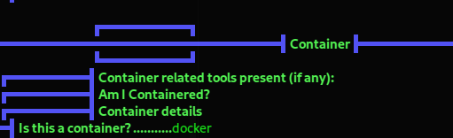

### Escaping the container

We also get some other useful information.

There's an unexpected bash script in the root directory.

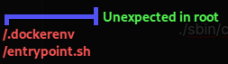

Let's go check it out and see what that’s about.

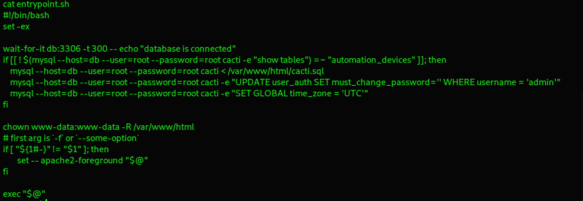

We seem to have a mysql database called simply "**db**" with user root and password also root.

Let's try to interact with the database and list the available tables. We can use the MySQL command-line client for that.

`mysql --host=db --user=root --password=root cacti -e "show tables"`

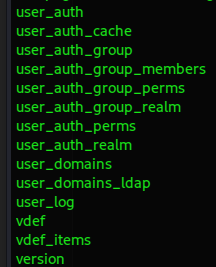

"**user_auth**" sure looks interesting. Let’s take a look inside by using a SELECT query.

`mysql --host=db --user=root --password=root cacti -e "SELECT * from user_auth"`

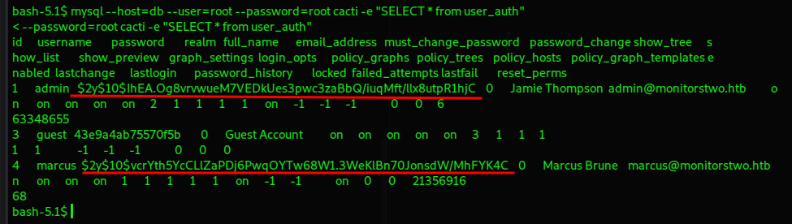

We find two users and their password hashes.

```
admin : $2y$10$IhEA.Og8vrvwueM7VEDkUes3pwc3zaBbQ/iuqMft/llx8utpR1hjC 
marcus : $2y$10$vcrYth5YcCLlZaPDj6PwqOYTw68W1.3WeKlBn70JonsdW/MhFYK4C
``` 

We can try to use https://hashes.com/en/tools/hash_identifier to find out what kind of hash we’re dealing with.

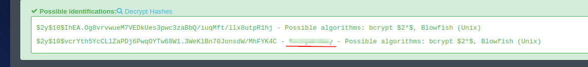

And we are really lucky, we don’t even have to crack the hashes ourselves, one of them already got a match.

Now we can try to log in as user marcus.

## User flag and more enumeration

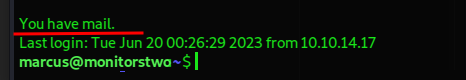

We are logged in and also have this message greeting us. Could be something worth investigating.

This is also a chance to grab the user flag from the home directory.

Now we can run **linpeas** once again, this time outside of the container.

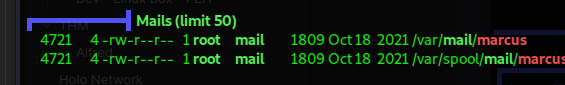

We have that mail coming up once again. If we weren’t already aware of the default mail directorires on Linux, now we would know exactly where to find it, so let’s go check it out.

## Root flag

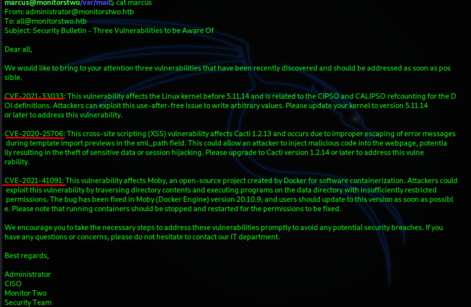

It’s like they’re doing our work for us. In this email, the Administrator informs of three vulnerabilities on the machine that we can research for ourselves and try to escalate privileges.

We find [this exploit](https://github.com/UncleJ4ck/CVE-2021-41091) for CVE-2021–41091 according to which we need to be root in the container itself for it to work. It exploits a flaw in the Docker engine Moby that concerns overly lax permissions like SUID which we encountered in the container environment in the beginning.

We need to be root in the container itself for it to work (which we already know how to do) and make absolutely sure that SUID is set on `/bin/bash`.

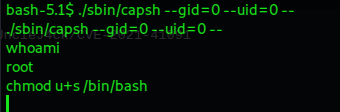

After this setup, we can upload the exploit to the machine where we’re logged in with user **marcus** and run it.

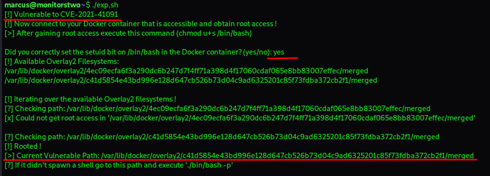

The exploit didn’t automatically spawn a shell, so let’s just follow the instructions given.

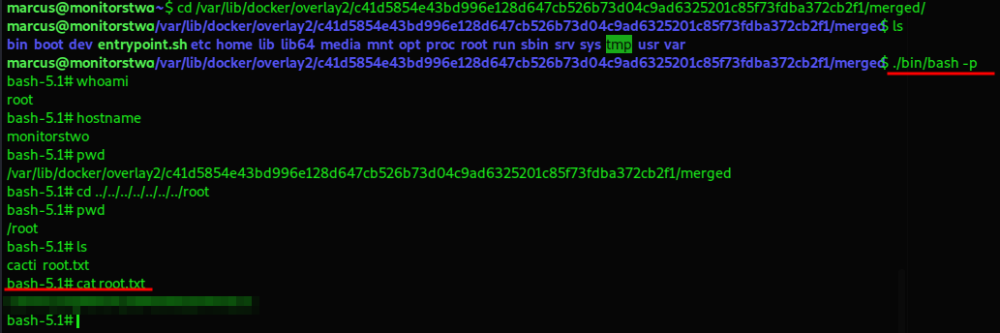

And so we’ve obtained the root flag.

---

Thank you to the creator of this box — [TheCyberGeek](https://app.hackthebox.com/users/114053). It’s very good to show how devastating public exploits can be and how much easier they can make an attacker’s life.

If you made it this far, thank you for reading!
