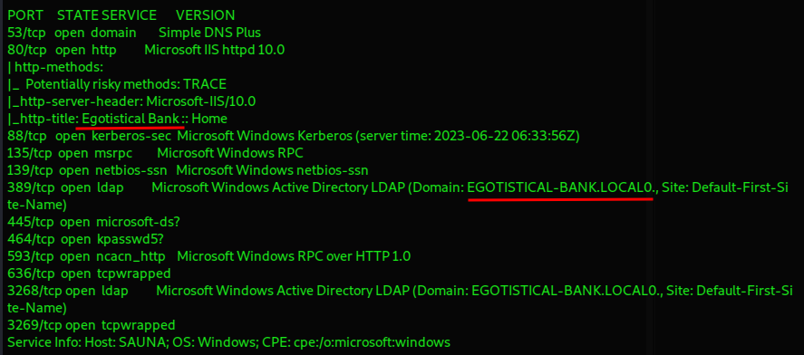
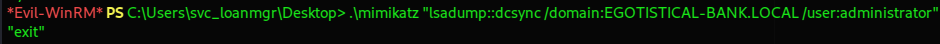

+++
title = 'HackTheBox Sauna Write-Up: Active Directory 101'
date = 2023-09-08T13:49:35+03:00
draft = false
+++

Sauna is an easy [HackTheBox](https://hackthebox.com/) machine which I did as part of the [Active Directory 101](https://app.hackthebox.com/tracks/Active-Directory-101) track. It tests your skills for AD enumeration and attacks, you’ll have to perform an AS-REP roasting attack and hunt for credentials, and be familiar with tools such as BloodHound and Mimikatz.

## Enumeration

We'll start as always by scanning the machine to find open ports and then doing more thorough scans on those.

`nmap -Pn -sCV -p53,80,88,135,139,389,445,464,593,636,3268,3269 10.10.10.175`

Nothing unexpected in the scan, we’re dealing with Active Directory after all. We have SMB, LDAP, Kerberos at port 88, and a website on port 80.

Just as was the case with the Forest machine, some of our SMB attack vectors are cut off, but there's no harm in trying.

### SMB - Port 445

We get successful anonymous login with **smbclient**, but no shares are listed.

Attempting enumeration with **Enum4linux** doesn’t give us more than the domain name and SID, no usernames.

SMB might be a full-on dead end as predicted.

We do have a website on port 80 though, so let's move on.

### Website on port 80

We find the website of a bank aiming to take all of our money.

By exploring the website as a regular we visitor, we find employee names on the About Us page in the Meet the Team section at the bottom.

Fergus Smith
Shaun Coins
Hugo Bear
Bowie Taylor
Sophie Driver
Steven Kerb

We're going to use a tool called [Namebuster](https://github.com/benbusby/namebuster) that generates a list of possible common username permutations. Interestingly enough, it was originally meant to be used specifically for this box. It's not the only tool of its kind, of course, there's others such as [Username Anarchy](https://github.com/urbanadventurer/username-anarchy),

`namebuster "Fergus Smith, Shaun Coins, Hugo Bear, Bowie Taylor, Sophie Driver, Steven Kerb"`

We end up with a list of 1296 potential usernames. We need to narrow it down so we're going to use **kerbrute** for username enumeration against Kerberos.

And we have a valid username which is *fsmith@egotistical-bank.local*. We can now use that to perform an AS-REP roasting attack which only requires a username to work. 
## User Flag

The attack is used to retrieve domain users who have "Do not require Kerberos pre-authentication" set and ask for their TGTs without needing to know their password.

`GetNPUsers.py -dc-ip 10.10.10.175 -request "egotistical-bank.local/fsmith -format hashcat`

Now that we have the user's TGT, we can take it offline and crack it with **Hashcat** and mode 18200, which gets us the user's password.

Next we can try using the obtained credentials to get a shell on the target with Evil-WinRM and we are successful, which lets us obtain the user flag.

## Pivoting to a Different User

Next we're going to upload **SharpHound** to the machine using the functionality built within Evil-WinRM so we can collect information about the domain.

`upload /root/Downloads/HTB/Sauna/SharpHound.exe C:\Users\FSmith\Desktop\SharpHound.exe`

Interestingly enough, after downloading the resulting zip file and importing it into BloodHound, it doesn't reveal anything particularly useful to us, so it's time for some manual enumeration.

I like to start with some good old credential hunting, you can follow [this article](https://juggernaut-sec.com/password-hunting/) to get familiar with different ways to look for credentials on Windows machines. 

A broad search in the registry produces a lot of output but it does give us the result we need.

`reg query HKLM /f password /t REG_SZ /s`

We can obtain that result quicker by checking common places in the registry where credentials may be stored.

Once such place is the winlogon registry key, which is tied to a setting in Windows called **Autologon**.

> Autologon enables you to easily configure Windows’ built-in autologon mechanism. Instead of waiting for a user to enter their name and password, Windows uses the credentials you enter with Autologon to log on the specified user automatically.

`reg query "HKLM\SOFTWARE\Microsoft\Windows NT\Currentversion\Winlogon"`

We now have both a username and a password.

If we attempt to login with svc_loanmanager, however, we are unsuccessful. This is where BloodHound comes to the rescue. If we check what we've obtained, we will find the proper username we need to utilise.

Once again, we can obtain a shell using Evil-WinRM.

## Root Flag

Since we have credentials for what seems to be a service account with potentially higher privileges, we can repeat the enumeration with SharpHound and when we use the filter for "Reachable High Value Targets" in BloodHound, we will find that the account has DCSync rights to the domain controller.

### DCSync with Mimikatz

We can upload **Mimikatz** to the machine to perform the attack. 

We need to be careful when running Mimikatz via a PS session. We need to utilise a one-liner and encase separate commands in quotation marks, otherwise the screen will fill with the initial start-up of "mimikatz #" and we'll have to kill our session to stop it. 

`.\mimikatz "lsadump:: dcsync /domain:EGOTISTICAL-BANK.LOCAL /user:administrator`

After utilising the `lsadump::dcsync` command to retrieve domain secrets, we obtain the NTLM hash of the administrator account.

Now we can perform a Pass-the-Hash attack with Evil-WinRM to log in as administrator and obtain the root flag.

Thank you to the creator of this box — [egotisticalSW](https://app.hackthebox.com/users/94858). It’s a very fun Active Directory box to test your enumeration and password hunting skills, knowledge of common AD attacks and tools.

If you made it this far, thank you for reading!

