+++
title = 'TryHackMe Brute It CTF Write-Up'
date = 2023-06-05T11:07:55+03:00
draft = false
+++

In this write-up I will go through the steps needed to complete the [Brute It](https://tryhackme.com/room/bruteit) CTF on TryHackMe by [ReddyyZ](https://tryhackme.com/p/ReddyyZ).

It's an easy room, where you need to know how to use nmap, gobuster, hydra, and basic knowledge of RSA keys and Linux privilege escalation.

---

## Enumeration

We'll start this challenge with an nmap scan which will usually be our first action.

We don't get any open ports unless we turn off host discovery with the `-Pn` flag.

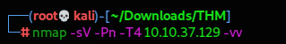

The results of our scan quickly let us answer the first four questions.

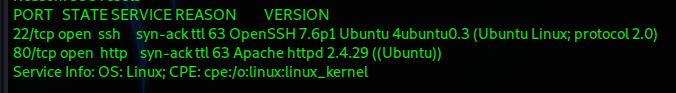

How many ports are open? **2**

What version of SSH is running? **OpenSSH 7.6p1**

What version of Apache is running? **2.4.29**

Which Linux distribution is running? **Ubuntu**

---

We only find the Apache2 default page when we put the IP in our browser.

Next we're going to run a `Gobuster` scan with our chosen directory list in order to find any hidden directories on the website.

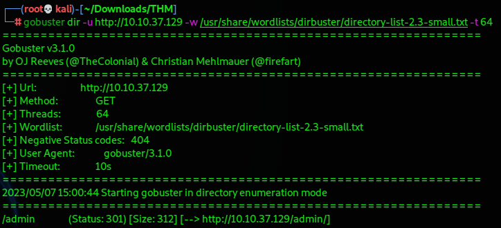

This lets us answer the next question.

What is the hidden directory? **/admin**

When we go to that directory in our browser, we are faced with a simple login form. What can we learn from that? Turns out we can learn plenty.

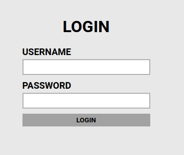

### Login Portal

Let's check the source of the page in case there's anything there that can help us. This should be standard practice.

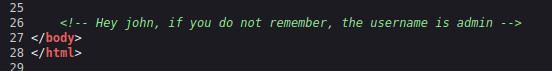

What do you know, we have the name "**john**" which we'll keep in mind for later, and we find out that the username is admin. All because of a forgotten comment in the html code.

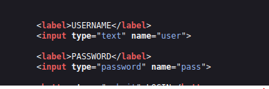

Another useful thing to note in the source code is the names of the input fields which are "***user***" and "***pass***". If you miss that in the html, you can find those out with BurpSuite as well.

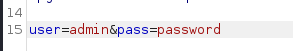

Let's enter the username admin and a random password to see what happens.

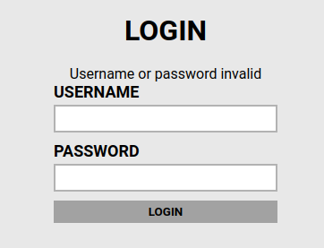

We get a simple error message which we can put to good use soon enough.

### Brute-force attack

Now, we need all of the information we've gathered so far in order to craft our Hydra command brute-force the login form:

```
- username = admin
- username and password input fields are called "user" and "pass"
- error message when inputting incorrect login details = "Username or password invalid"
```

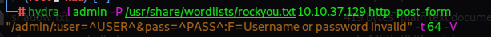

We run our newly crafted Hydra command and soon enough we have our password.

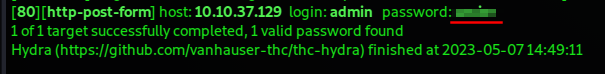

We can successfully use to log in as admin. There we find a web flag at the end, a message for **john** again, along with a link to john's private RSA key. Now that's a useful find!

## User flag

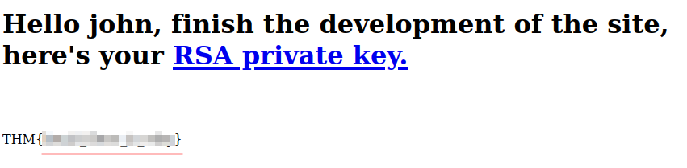

We can follow the link to the RSA key and use wget to download it to our machine.

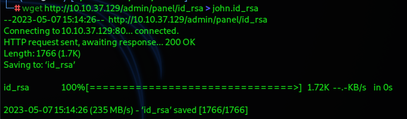

Next, we need to convert the key into a hash format that our favourite hash cracker John the Ripper can work with by using `ssh2john`.

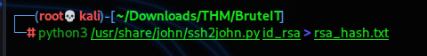

Then we can run the hash file through John and receive the passphrase for the RSA key.

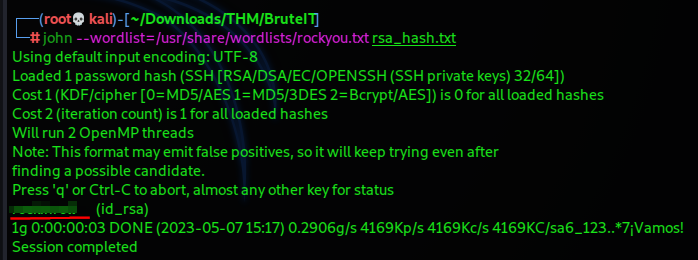

One last thing to do — we shouldn't forget to give the id_rsa file the proper permissions it requires. And we're good to go.

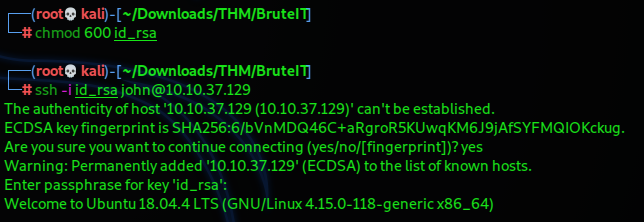

We're logged in as john and we can get the user flag.

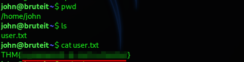

## Privilege Escalation - Root Flag

It's time to find a way to escalate our privileges. The easiest wins are usually binaries that we can run with sudo or that have the SUID bit set. You can look for those first or go through your list (that you hopefully have) of commands for enumeration of Linux systems in order.

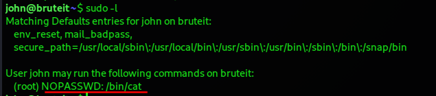

We find that we can run the `cat` command with sudo privileges without a password. Let's look that up on [GTFOBins](https://gtfobins.github.io/).

We find out that we can exploit this in order to read a file. What's the most useful file we can get our hands on? That's right, the illusive `/etc/shadow` file.

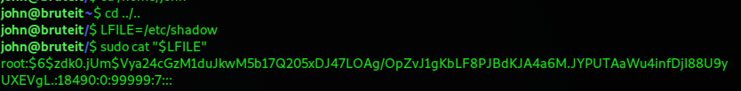

And now we've got our hands the hash for the root password.

You probably know what follows. We also need to read `/etc/passwd`.

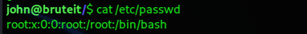

Then we can create the two files we need for the unshadow command.

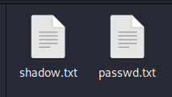

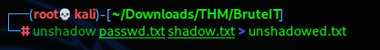

This will give us a txt file that John can work with.

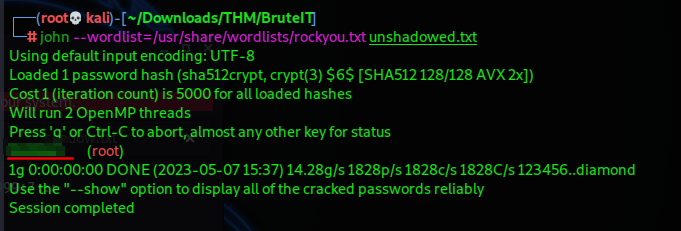

And so we’ve obtained the password for root.

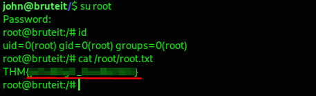

Time to switch to that user in order to receive our final flag and complete this challenge.

---

Thank you to the creator of this room! It's a fun challenge to test your skills in using some fundamental tools.

If you made it this far, thank you for reading!
