+++
title = 'TryHackMe Linux Privilege Escalation Capstone Write-Up'
date = 2023-04-30T11:09:58+03:00
draft = false
toc = false
+++

In this write-up I will go through the steps needed to complete the Linux PrivEsc Capstone at the end of the [Linux Privilege Escalation](https://tryhackme.com/room/linprivesc) room on TryHackMe by [tryhackme](https://tryhackme.com/p/tryhackme) and [1337rce](https://tryhackme.com/p/1337rce).

You shouldn't have any issues with this challenge if you've completed the room up to this point. I personally chose to make a cheatsheet with all of the commands presented throughout the room and go through them methodically to look for vulnerabilities to exploit.

I used SSH to connect to the target. You can use the browser machine as well for most of this, but as we need access to an attacking machine as well, I found SSH more convenient.

---

So let's begin with our enumeration of the target. I won't be posting every single command I ran, but just give some examples instead.

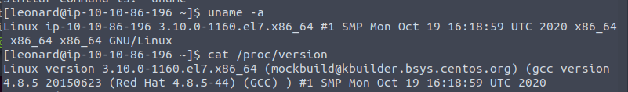

I searched for a kernel exploit after getting the above information, but couldn't really find anything definitive, so I didn't spend too much time on this.

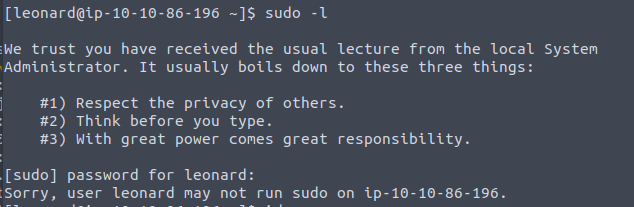

I was hoping there would be at least something we could run with sudo permissions, but alas no such luck.

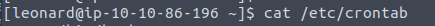

There were no scheduled cronjobs to exploit either.

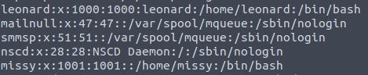

We can read the `/etc/passwd` file and get some information about the users on the system. We can see another user named missy. Might be something to keep in mind.

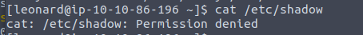

As is to be expected, we cannot read the `/etc/shadow` file as we don't have root permissions.

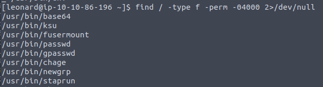

Next, I searched for files with the SUID bit set and the very first result is a curious one. When looking things up on [GTFOBins](https://gtfobins.github.io/), it looks like we can utilise the base64 binary to read files.

Since this binary is owned by root, we can try to read the `/etc/shadow` file.

We need to navigate to the root directory and specify the directory of the binary to make sure the command executes properly.

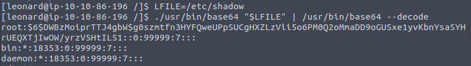

And we have the contents of the shadow file, which has the hashes for users **root** and **missy**.

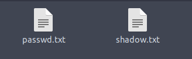

Now that we have both the passwd and the shadow file, we can copy their contents into two separate files as above, then use the unshadow command to prepare a file for John to crack.

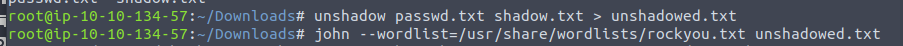

Maybe we'll get lucky and get the root hash cracked.

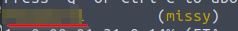

That's not what happens, of course, but we do get the password for **missy** which allows us to pivot to that account and retrieve the first flag.

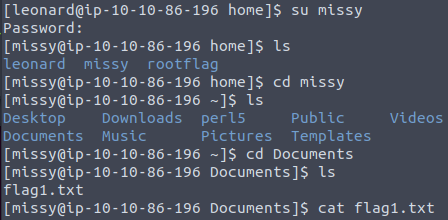

We can repeat the process of enumeration to see if there's a way to get root. I was lucky as the very first command I decided to run showed me the right way forward.

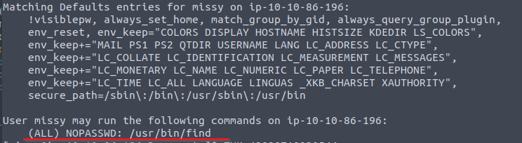

We discover that we can run the find command with sudo permissions. As usual, we can follow the instructions on GTFOBins and we quickly have our root access.

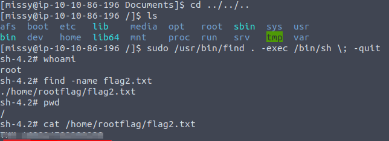

We retrieve the second flag and so the challenge is completed. I do recommend having a list of commands and/or scripts on hand that you can run in order to thoroughly enumerate your Linux target for possible exploitation paths.

---

Thank you to the creators of this room! It was fun to put to good use everything the Privilege Escalation room teaches.

