+++
title = 'TryHackMe Net Sec Challenge Write-Up'
date = 2023-04-23T11:10:30+03:00
draft = false
toc = false
+++

In this write-up I will go through the steps needed to complete the [Net Sec Challenge](https://tryhackme.com/room/netsecchallenge) room on TryHackMe by [tryhackme](https://tryhackme.com/p/tryhackme) and [strategos](https://tryhackme.com/p/strategos).

This room lets you practice all the skills you should have picked up if you've gone through the Network Security Module.

As the introduction says, all the questions can be solved using **nmap**, **telnet** and **hydra**.

---

Let's begin by performing an nmap service scan of all ports.

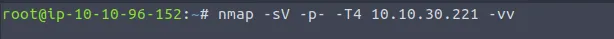

This should give us plenty of information and as expected, once we get back the results we can answer the first three questions.

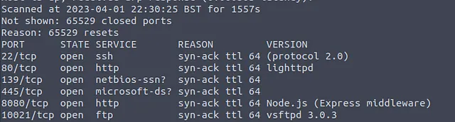

>    What is the highest port number being open less than 10,000? 8080
>    There is an open port outside the common 1000 ports; it is above 10,000. What is it? 10021
>    How many TCP ports are open? 6

---

The next question wants us to find the flag hidden in the HTTP server header.

How would we do that with the limited tools we have available to us? Let's see if the nmap NSE library has anything that can help us.

We'll get quite a few results when we list all the http scripts that are available, but there is one that should catch your eye for this particular task.

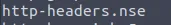

Looks promising, let's run it and see if it gives us the result we are looking for.

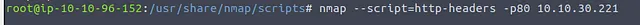

Bingo! The script gives us the flag we need. You'll have to run it yourself to find out what it is.

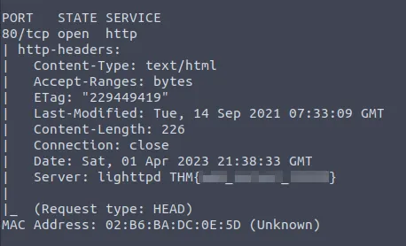

---

Next we're looking for the flag hidden in the SSH server header.

Now, if you ran an nmap scan with the `-sV` flag and looked carefully through the output, you would already have the answer to that question.

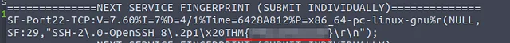

But let's say you missed that or ran a different scan, how else would we get the same result?

We can try looking through the nmap scripts for ssh, but we find nothing promising this time. What if we connect to the port with telnet?

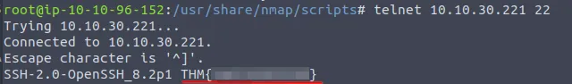

As soon as we do that, we are greated with the header and the flag we need.

---

>    We have an FTP server listening on a nonstandard port. What is the version of the FTP server?

The nmap scan we ran in the beginning already gave us that information. The port is **10021** and the FTP server version is **vsftpd 3.0.3**.

---

After that we are given two usernames that can give us FTP access — **eddie** and **quinn**.

We're going to have to find the passwords that go along with those usernames however. Hydra should come in handy here along with our trusty `rockyou.txt` wordlist.

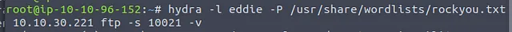

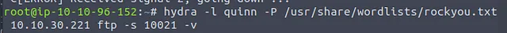

We run Hydra for both accounts and very quickly receive the corresponding passwords. Now we have to log in as both users and see if we can find any files.

We are met with success when we log in as **quinn**.

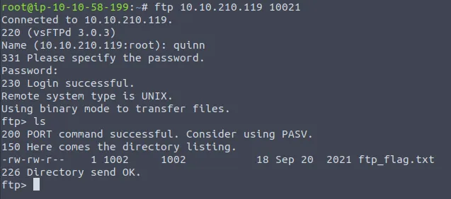

All we need to do is download the file to our local machine with get and then read it to obtain the flag.

---

We have one last task remaining when we navigate to the target IP at port 8080. We have to scan the deployed machine as covertly as possible to get our last flag.

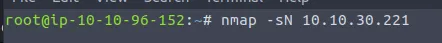

The very first thing I tried was a NULL scan which just happened to work.

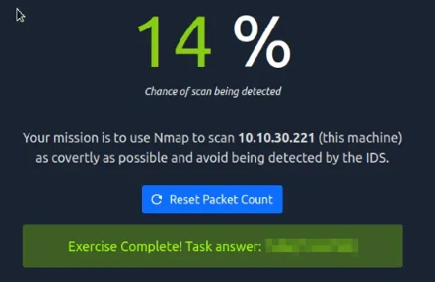

Scanning all ports will also give the same result.

---

And so the Net Sec Challenge is complete.

Thank you to the creators of this room! It was fun to test out some of the vast capabilities of **nmap** and to crack some passwords with **hydra**.

If you made it this far, thank you for reading!