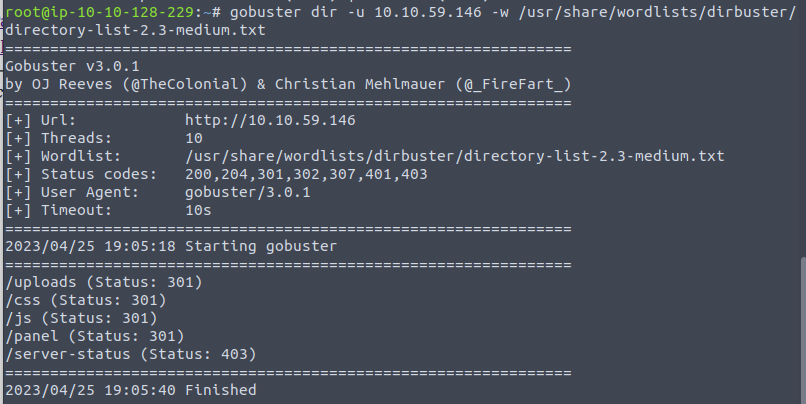

+++
title = 'TryHackMe RootMe CTF Write-Up'
date = 2023-05-08T11:09:26+03:00
draft = false
toc = false
image = "0.png"
+++

In this write-up I will go through the steps needed to complete the [RootMe](https://tryhackme.com/room/rrootme) CTF for beginners on TryHackMe by [ReddyyZ](https://tryhackme.com/p/ReddyyZ).

It's a very beginner-friendly challenge, you only need some knowledge of reverse shells and basic Linux Privilege escalation.

---

First, we're going to start by running a thorough nmap scan.

Technically, you will get the answers required without going as far as scanning all ports, but we should follow a consistent and thorough methodology.

You will find that there are two ports open — 22 and 80, with the expected services running on them.

The scan results immediately let you answer the first three questions in task 2.

>     How many ports are open? 2
>     What version of Apache is running? 2.4.29
>     What service is running on port 22? SSH

---

Next, we're tasked with using GoBuster to find directories on the web server that's running on port 80.

We're going to use one of the dirbuster wordlists you will find on the AttackBox or your Kali machine.

We quickly get some useful results back.

>      What is the hidden directory? /panel/

If we go to the `/panel` directory, we have a file upload form. That should come in handy for getting a shell.

---

We can upload a file in order to obtain a reverse shell.

We need to find out if there are any filters we need to bypass. Let's try with a basic PHP reverse shell that you can find under `/usr/share/webshells/php`.

Don't forget to change the IP in the file to your attacking machine's IP. You can also choose a different port to listen on.

Uh-oh, we get an error when we try to upload our php file.

Let's see if we could perhaps use a different extension for our file. A quick Google search gives us some options to try.

We'll go in order and try changing the file extension to `.phtml`.

Success! The form lets us upload our shell and we can find it under the `/uploads` directory that we also found with Gobuster earlier.

---

We'll keep it simple and utilise a basic netcat listener and execute the shell.

We receive a connection with the privileges of **www-data**, a low-level user.

We can use the find command to figure out where the `user.txt` file is located and then read it to get our flag.

---

Now we have to figure out how to escalate our privileges to root and obtain the second flag.

The task gives us quite a big hint — we need to search for files with SUID permissions set.

Again, we can utilise the find command for that.

By examining the results we get and cross-checking them with [GTFOBins](https://gtfobins.github.io/), we find that python is something we could utilise in this case.

Now we just need to apply the instructions from the website to receive our root shell and obtain our flag. We need to specify the location of the binary in our command.

I've kept this simple, but something useful we can do is stabilise our shell as soon as we obtain a connection on our nc listener. This will give us a more interactive shell so we don't have to worry about accidentally killing our shell with `Ctrl + C`, plus we can cycle through our previous commands.

You can find out more about in the [What the shell?](https://tryhackme.com/room/introtoshells) room on TryHackMe.

---

Thank you to the creator of this room! It's a fun, simple challenge to jump into and test some basic Linux privesc skills.

