+++
title = 'TryHackMe Vulnerability Capstone Write-Up'
date = 2023-03-28T11:11:17+03:00
draft = false
toc = false
+++

In this write-up I will go through the steps needed to complete [Vulnerability Capstone](https://tryhackme.com/room/vulnerabilitycapstone) challenge room on TryHackMe by [tryhackme](https://tryhackme.com/p/tryhackme) and [cmnatic](https://tryhackme.com/p/cmnatic).

It's not a hard room if you've completed the [Vulnerability Research](https://tryhackme.com/module/vulnerability-research) module or already have prior knowledge of how to find and exploit vulnerabilities.

---

Once we deploy the vulnerable machine in Task 2 and give it some time to boot, we can start by performing a simple nmap scan to gather some information about open ports and any services running on the machine.

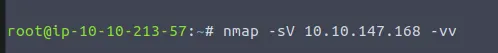

These are the results we get:

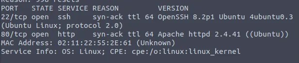

We find two open ports, the services running on them and the operating system we're working with.

A quick search on [exploit-db](https://www.exploit-db.com/) suggests we likely shouldn't be wasting our time trying to exploit these services.

---

Now let's visit the website hosted on port 80.

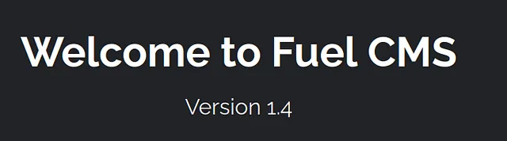

We are immediately greeted with this home page which provides us with the answers to the following questions:

>   What is the name of the application running on the vulnerable machine? Fuel CMS
>   What is the version number of this application? 1.4

Searching [exploit-db](https://www.exploit-db.com/) gives us some useful results this time:

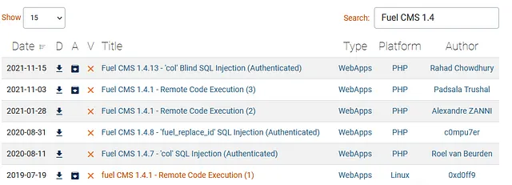

We can click on one of the RCE exploits to find out the CVE number and answer the next question:

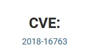

>   What is the number of the CVE that allows an attacker to remotely execute code on this application? 2018–16763

Examining the available exploits, one of them is in Ruby and two of them in Python, but don't seem ready to go out of the box.

That's not unexpected, but let's check just in case whether we can find something simpler on GitHub.

---

A simple Google search later, [this exploit](https://github.com/ice-wzl/Fuel-1.4.1-RCE-Updated) catches my eye:

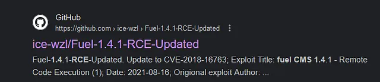

It's actually an updated version of one of the exploits we found previously, whereby the author ensured that it functions as a stand-alone exploit.

Let's create a file with our exploit and copy the code from github (make sure to click on raw):

We shouldn't forget to make the sure the file is executable before we use it.

Reading about the usage of the exploit on the GitHub page tells us that we need to set up a Netcat listener to catch the shell that will spawn once we run the exploit:

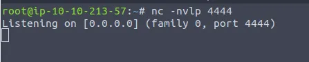

Opening another terminal, we can see that the exploit takes three arguments: target IP, IP of our attacking machine, and the port we're listening on. Let's try to run it with these arguments:

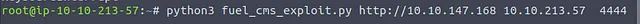

Going back to our Netcat listener, voila, we have a shell and we can try some basic commands like `whoami` and `pwd` to find out where we are in the system.

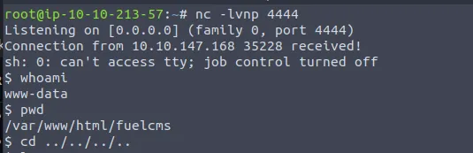

As you can see, we need to change directory and get to the /home/ubuntu folder to find our flag.

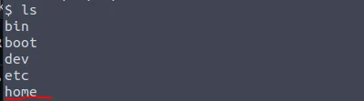

Going back 4 steps and using the `ls` commands shows us we're where we need to be to access the `home` folder.

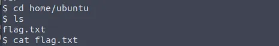

You'll have to replicate these steps to get the flag for yourself.

---

Thank you to the creators of this room where you get to apply your vulnerability research skills.

If you made it this far, thank you for reading!

