+++
title = 'TryHackMe Web Enumeration Write-up'
date = 2021-05-18T11:11:52+03:00
draft = false
toc = false
+++

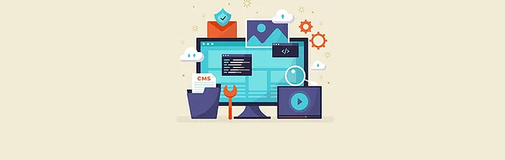

In this write-up I will go through the steps needed to complete the challenges in the [Web Enumeration](https://tryhackme.com/room/webenumerationv2) room on TryHackMe by [ben](https://tryhackme.com/p/ben), [cmnatic](https://tryhackme.com/p/cmnatic), and [Nameless0ne](https://tryhackme.com/p/Nameless0ne).

It's an easy room, all the theory you'll need is laid out very thoroughly by the creators, but in case you do get stuck, let's go through the steps together.

---

**We come to our first machine in task 6. We'll be using `Gobuster` for this one.**

Add "webenum.thm" to your hosts file as described and let's run a standard directory scan with Gobuster to see what directories we can find.

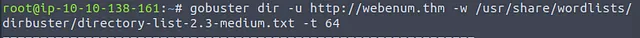

Here's what Gobuster comes up with and so we have the answer to our first question:

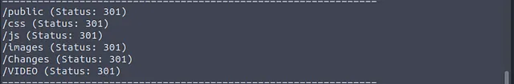

>   Other than the standard css, images and js directories, what other directories are available? - public,Changes,VIDEO

Now, let's run another scan on the directory `/Changes` that we just discovered. This time, however, we're going to add some common extensions to look for like `html, js, txt, conf`.

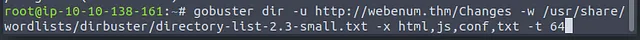

The results of this scan give us the answer to our second question.

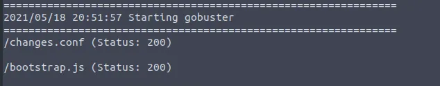

>   In the "C******" directory, what file extensions exist? - conf,js

(*Notice that I used the small directory list here as the scan takes less time to run and is sufficient for our purposes.*)

Next, we're looking for a flag that's hiding out there somewhere. The easiest thing to do here is just visit the directories we found in our initial scan by typing them in our browser.

I'll leave it up to you to find which one holds the flag, this is how it should look:

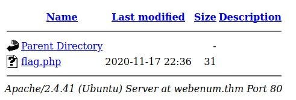

Just open the file and you have your first flag.

(*Of course, you can also scan each of the directories in turn and look for extensions such as `txt` and `php`, which are common formats for storing flags.*)

Next, we'll be scanning for virtual hosts on this server by using the vhost mode and one of the common wordlists for subdomains.

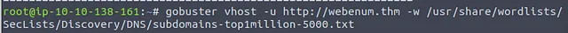

Gobuster immediately comes up with some results:

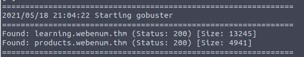

>   There are some virtual hosts running on this server. What are they? - learning,products

Don't forget to add them to `/etc/hosts`, so we can enumerate them as well:

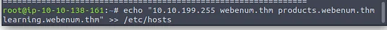

Now all that's left is to find the second flag on this machine, for which we'll have to scan both of those hosts and look for common flag extensions such as `php` and `txt`.

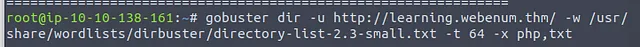

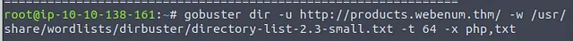

Run both scans, one of those will reveal the flag like so:

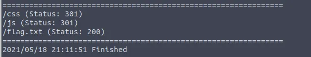

Just type the address in your browser, and you'll have your flag.

---

**Our next machine is in task 9. This time our tool is `WPScan`.**

As recommended, we can run this command to update the WPScan database before we start

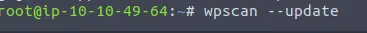

Or once you begin your first scan, you will be greeted with this message:

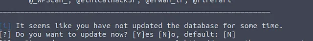

Let's begin by enumerating the website's themes with the argument `t`.

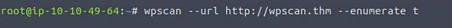

We will quickly get the results we need to answer the first two questions in this task.

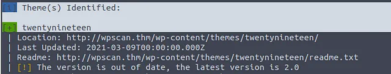

>   What is the name of the theme that is detected as running? - twentynineteen
>   WPScan says that this theme is out of date, what does it suggest is the number of the latest version? 2.0

Next, we'll enumerate the site with the argument `p` for plugins.

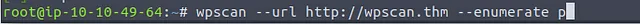

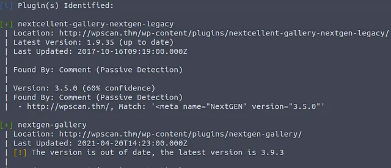

WPScan quickly comes back with the answer to the next question.

>   What is the name of the plugin that WPScan has found? - nextgen-gallery

Finally, we'll also enumerate the site for usernames with u as an argument.

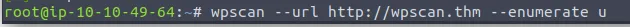

WPScan has identified a username for us.

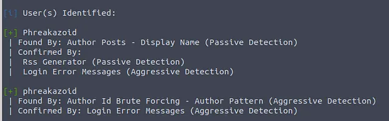

>   What username can WPScan find? - phreakazoid

We can use this information to try and brute-force the password with **WPScan**. We'll use the `rockyou.txt` wordlist and the username we found.

`wpscan --url http://wpscan.thm --passwords /usr/share/wordlists/rockyou.txt --usernames phreakazoid`

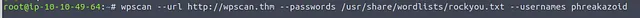

We have a valid combination in no time.

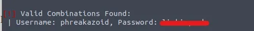

>   What is the password to this user? (Just run the command to find out.)

---

**The next machine we have to work with is in task 12 and it's time to see what `Nikto` can do.**

We'll start by running a basic scan, just adding the host.

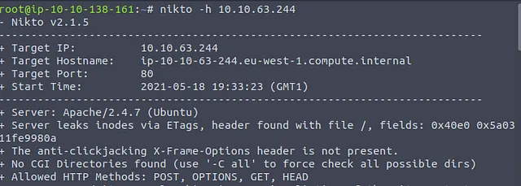

The results already give us plenty of information. By default Nikto will be scanning port 80.

>   What is the name & version of the web server that Nikto has determined running on port 80? - Apache/2.4.7

Now, we'll run another scan, this time adding some extra ports with the `-p` flag.

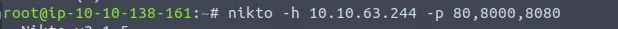

We find another service running on port 8080. And we get enough information about it to answer the next two quetions at once.

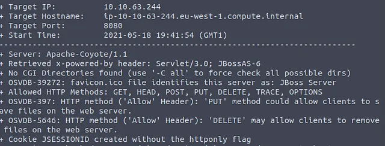

>   There is another web server running on another port. What is the name & version of this web server? - Apache-Coyote/1.1

>   What is the name of the Cookie that this JBoss server gives? - JSESSIONID

Since this room is meant to be beginner-friendly, we already knew what ports to look for to find the second server. If we don't, we might try something like running an nmap scan and passing the results on to Nikto:

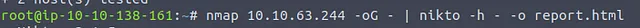

Plus, we've made sure the output will be saved for us, so we can go through it easily.

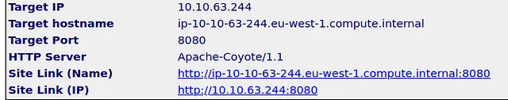

Here, we see the second server and the port it's running on.

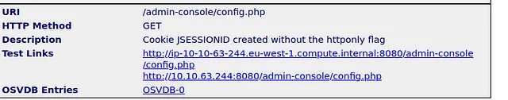

And here we see the cookie that was created.

---

Thank you to the creators of this room, it was a very good introduction to these tools and I enjoyed it.

If you made it this far, thank you for reading!