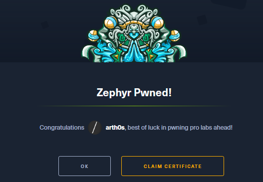

+++
title = 'HackTheBox Zephyr Pro Lab Review'
date = 2023-10-21T15:09:29+03:00
draft = false
+++

These days I have been focused on the CPTS Penetration Tester Job Path on HackTheBox Academy and after completing their module on Active Directory Enumeration & Attacks, I decided that I want some hands-on practice.

I chose to try my hand at Zephyr, one of the Pro Labs offered by HackTheBox on their main platform, in order to put my skills to the test in an unknown corporate-like environment.
## Premise

Briefly, you are tasked with performing an internal penetration test on an up-to-date corporate environment with the goal of compromising all domains.

The lab is advertised as an intermediate Level 1 Red Team Operator lab, although based on my experience I wouldn’t call it a red team lab as you’re dealing with regular Windows Defender and AV.

There’s a total of 17 flags to grab, three domains and consequently three domain controllers with their corresponding servers and workstations.
## What To Expect

This Pro Lab is pure Active Directory almost in its entirety. You will see what I mean by almost if you decide to try it, but every attack you perform will be based on abusing Active Directory misconfigurations and leveraging elevated permissions of users. There are no quick wins to be had, no cases of “run this exploit to get Domain Admin”.

You need to be familiar with pivoting and a large variety of techniques for Active Directory abuse, lateral movement, crossing trust boundaries, SQL attacks, escalating privileges and more. And of course, thorough enumeration is a must as always.

BloodHound, crackmapexec/netexec and the Impacket toolkit will be of great use on your journey to full compromise and you’re not going to be able to rely on a GUI with RDP.

The CPTS path does cover quite a lot of what you will encounter in the lab, but you’re also going to have to do your research and there’s plenty you can learn along the way. I definitely added some new techniques to my arsenal and broadened my knowledge on Active Directory exploitation.

Overall, it took me about 8–9 days to compromise all the domains and grab all the flags. This will vary based on how much time you have and your prior knowledge.
## Conclusion

I fully recommend this Pro Lab to anyone who is looking for practice with AD pentesting. The lab is pretty stable and I did not run into major issues.

If you’ve never tried the Pro Labs at HackTheBox before, the lab resets at the same time every 24 hours, so make sure to take good notes and keep any credentials you find so you can go back to where you left off after the reset.

You can go a step further and practice your reporting skills after to make the most out of the experience.

Hope this review has been helpful and happy hacking!